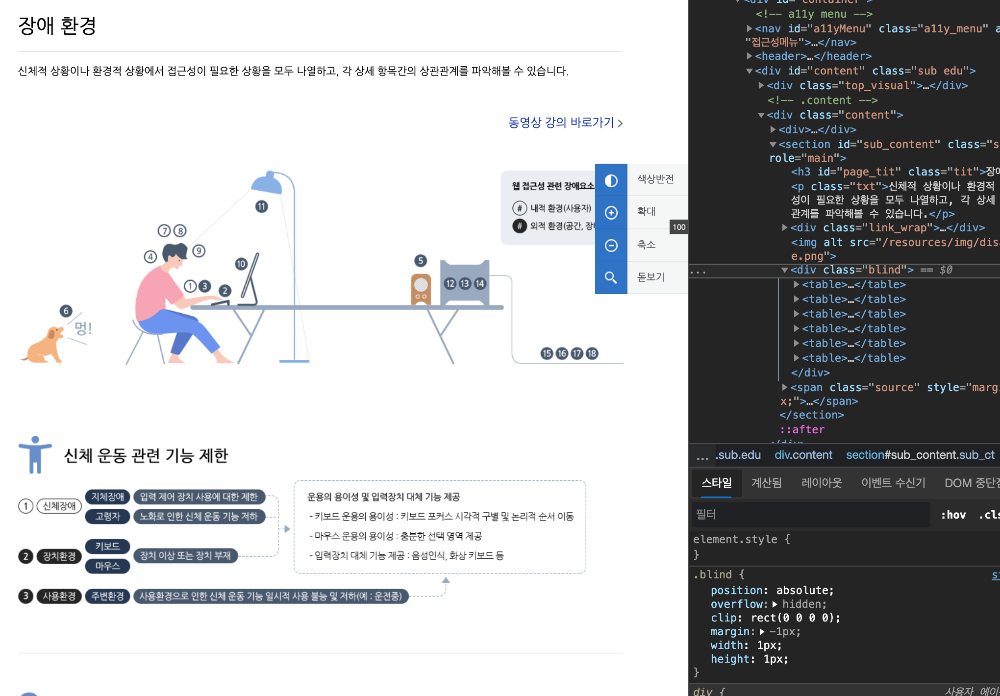
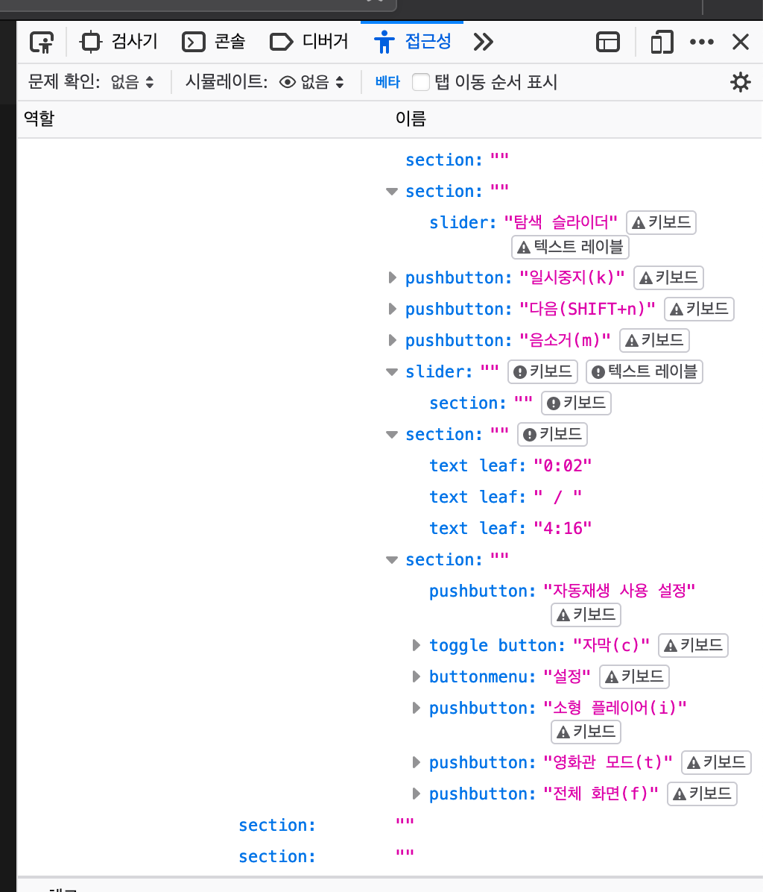

# 1.1 대체 텍스트

텍스트 콘텐츠가 아닌 경우에 그에 상응하는 **대체 텍스트**를 제공하여야 합니다. 텍스트 콘텐츠를 시각적인 요소를 첨가하여 표현하기 위해 화상 텍스트로 제공하였다면, 시각적인 요소를 제외한 콘텐츠의 내용을 **대체 텍스트**를 통해 전달하여야 합니다. 그 외에 경우에는 아래에 지침을 따릅니다.

## 1.1.1 텍스트가 아닌 콘텐츠 [A]

텍스트가 아닌 콘텐츠에 대해서는 해당 콘텐츠를 처리하는 방법에 대한 정보를 대체 텍스트를 통해 제공해야 한합니다.

> 대체 텍스트의 목적은 해당 콘텐츠의 '이해'가 아닌 '인식'입니다. 이해는 정확한 인식 이후에 일어나기 때문에 분리하여 생각하는 것이 좋습니다. 대체 텍스트는 해당 콘텐츠를 정확히 인식하게 하기 위해 콘텐츠를 처리(이해)하는 방법에 대한 설명을 제공하여 피제공자는 해당 콘텐츠를 자신에게 적합한 방법으로 처리할 수 있습니다.

> 대체 텍스트는 단순히 시각, 청각 장애뿐 아니라 인지, 학습, 신경장애를 가진 사람들에게 콘텐츠의 처리(이해)에 불편을 최소화 하는 목적도 있습니다.

### 조작, 입력

제공한 콘텐츠가 어떤 조작이나 입력에 연관이 있다면, 해당 조작이나 입력의 용도와 목적을 설명할 수 있어야 합니다. 대표적으로 UI 구성요소의 기능을 대체 텍스트로 제공하는 것 입니다.

### 시간 기반 미디어

미디어의 맥락와 필요에 따라 해당 맥락에서 제공하는 이유, 시간 기반 미디어를 조작할 수 있는 수단, 미디어 내의 영상의 유무, 음성의 유무, 배포의 방식, 미디어를 처리하기 어려울 경우 대체 수단 등의 정보를 제공해야 합니다.

### 시험

시험에 있어 대체 텍스트는 대부분 효과적이지 않습니다. 예를 들어 듣기 시험에 있어 대체 텍스트가 제공된다면 해당 시험은 무효와 다름이 없게 됩니다. 그렇기 때문에 해당 콘텐츠(시험)의 목적을 설명하는 대체 텍스트를 제공하는 것이 좋으며, 물론 대체 텍스트의 내용에는 해당 시험 문제에 대한 힌트를 제공하는 내용을 포함해서는 안됩니다.

### 감각

감각을 통해 콘텐츠를 인지해야 한다면, 해당 콘텐츠의 제목 뿐 아니라 맥락과 설명을 함께 제공해 인식을 도와야 합니다. 예를들어 어떤 회화 이미지를 제공한다면 해당 이미지가 표현하고 있는 시각적 요소에 대한 간결한 서술과, 맥락상 추가적으로 필요한 정보 등을 제공하여 인식에 도움을 주어야 합니다.

### 캡챠

캡챠는 사이트 내에서 기계의 접근을 방지하기 위하여 피제공자가 사람인지 식별하는 방법 중 하나이며, 일반적으로 기계가 인지하기 어려운 콘텐츠를 제공하고 이용자가 감각을 이용해 그 콘텐츠를 인지하여 서술하는 방법을 사용합니다. 대체 텍스트를 이용해 피제공자의 시각 장애, 인지 장애 등을 고려하여 캡챠를 통과할 수 있도록 적절한 대책을 제공해야 합니다.

### 장식, 형식, 보이지 않는 요소

콘텐츠가 단순 시각적 장식요소이거나 이미 제공 되어있는 콘텐츠의 부가적으로 필요한 경우 또는 형식요소일 경우에는 보조기기가 아예 인지하지 못하도록 처리하여야 합니다.

### 대상

- 시각을 이용하는 데에 어려움이 있어 보조 기술을 통해 청각(TTS, 음성해설 등), 촉각(점자 등) 등의 대체 감각으로 시각적 콘텐츠를 처리해야 합니다.
- 청각을 이용하는 데에 어려움이 있어 보조 기술을 통해 시각(문서, 수화 등), 촉각(점자 등) 등의 대체 감각으로 청각적 콘텐츠를 처리해야 합니다.
- 사진, 도면, 그래프, 애니메이션 등의 인지, 이해함에 불편을 겪는 사람들에게 대체 텍스트를 제공해야 합니다.
- 그 외에 기계적으로 웹페이지 내의 자료를 수집할 때 연관성을 부여합니다.

### 예시

- 인포그래픽 
  인포 그래픽은 기본적으로 전달하고자 하는 정보를 이미지를 통해 직관적으로 전달하는 콘텐츠이지만, 시각적, 인지적 측면에서 오히려 인식에 불편을 겪을 수 있기 때문에 대체 텍스트를 통해 서술형으로 제공할 수도 있습니다.

  
  네이버 널리 웹사이트 내의 장애환경에 대한 인포그래픽은, 시각적 콘텐츠와 함께 테이블을 함께 시각적으로만 숨겨놓아서 스크린 리더 등의 보조기술을 통해 인포그래픽 요소를 인식할 수 있게 되어있습니다.

  > 대체 텍스트를 반드시 alt속성으로만 전달할 수 있는 것은 아닙니다.

- 유튜브 플레이어 
  
  유튜브 에서 영상을 볼 때, 자막의 유무와 플레이어의 모든 버튼과 요소에 대체 텍스트와 단축키 지정이 되어 있기 때문에 영상의 조작방법 인식할 수 있습니다.

## 참고 자료

- [WCAG 2.1 Understanding Success Criterion 1.1.1: Non-text Content](https://www.w3.org/WAI/WCAG21/Understanding/non-text-content.html)
- [네이버 널리 - 장애환경 인포그래픽](https://nuli.navercorp.com/education/disabilityType)
