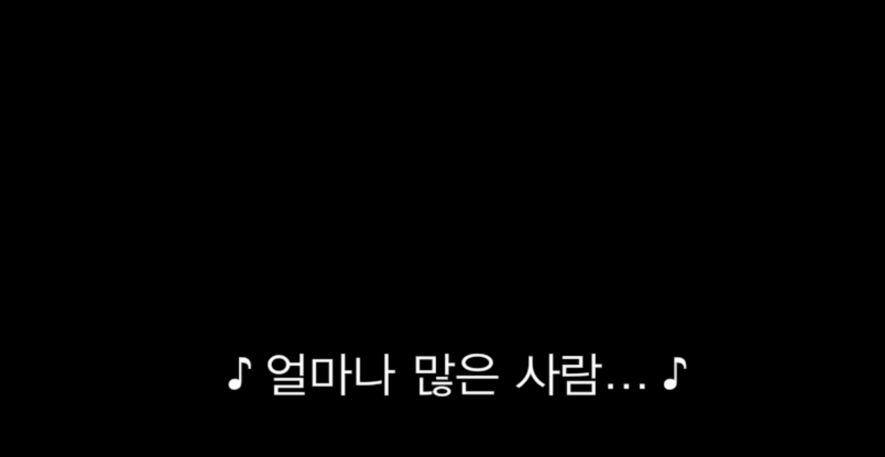

# 1.2 시간 기반 미디어

시간에 의존해 **재생**되는 미디어를 통틀어 시간 기반 미디어라 일컬으며 크게 음성이 재생되는 음성 미디어와 화상이 재생되는 영상 미디어로 재생 방식에 따라 구분할 수 있으며, 사전 녹음/녹화된 미디어와 실시간으로 제공되는 미디어로 배포 방식에 따라 구분할 수 있습니다.

> **동기화된 미디어**
> 미디어 콘텐츠를 구성하기 위해 하나 이상의 시간 기반 미디어가 다른 형식의 시간 기반 미디어와 동기화 되어 제공되는 미디어를 일컫는 말로, 보통 영상과 음성이 동기화되어 같은 시간의 흐름으로 제공되는 시간 기반 미디어 콘텐츠를 표현합니다. 단 해당 동기화된 미디어가 독립적이지 않거나 미디어들이 이미 제공된 텍스트 콘텐츠의 대체수단으로 제공되며 그 관계가 정확히 명시된 경우라면 예외할 수 있습니다.

> **시간 기반 미디어에 대한 대체수단**
> 시간 기반 미디어를 대체할 수 있는 텍스트 설명, 예를 들면 대본이 있습니다. 시간 기반 미디어에 대한 대체수단은 시간까지 대체할 수 있어야 하며, 이를 통해 자막과 구분할 수 있습니다.
> 사전 녹음 / 녹화된 시간 기반 미디어가 텍스트에 대한 대체수단으로 제공되고 있으며 그 관계가 정확히 명시된 경우라면 생략해도 됩니다.

<!-- > 해당 지침은 피제공자에게 재생 방식과 배포 방식을 고려하여 시간 기반 미디어의 대체 컨텐츠를 제공해야 한다는 '인식'까지의 지침이며 제공하는 대체 컨텐츠의 내용에 관한 지침과 정의는 포함하지 않습니다. -->

## 1.2.1 음성 전용, 영상 전용 [A]

독립적으로 시각, 청각적인 콘텐츠의 경우 하나의 감각으로 모든 내용을 인지해야 하기 때문에 반드시 완전히 대체 할 수 있는 대체수단을 제공해야 합니다.

- 사전 녹음된 음성 전용 콘텐츠의 경우 해당 콘텐츠를 이해할 수 있도록 시간 기반 미디어 대한 대체수단(대본 등)을 제공해야 합니다.
- 사전 녹화된 영상 전용 콘텐츠의 경우 해당 콘텐츠를 이해할 수 있도록 같은 내용의 시간기반 미디어(음성 나레이션)또는 해당 시간기반 미디어의 대체수단을 제공해야 합니다.

### 대상

- 시각장애 등으로 어려움이 있는 경우 청각을 통한 대체 수단을 제공합니다.
- 청각장애 등으로 어려움이 있는 경우 청각과 시간에 기반하지 않은 대안을통해 쉽게 인식할 수 있게 합니다.

### 예시

- 무성영화의 진행을 서술하는 대본을 별도의 링크로 제공할 수 있습니다.
- 녹음된 라디오 / 팟캐스트 등의 대본을 별도의 링크로 제공할 수 있습니다.

## 1.2.2 자막 (Closed Caption) [A]

동기화된 미디어에 포함한 사전 녹음된 음성 컨텐츠에는 자막을 제공해야 합니다.
접근성 측면에서 자막은 단순 대사의 나열(Subtitles)이 아닌 해당 장면의 청각적인 요소를 모두 설명해야 한다. 예를 들어 현재 흐르고 있는 배경음악의 분위기 등을 설명할 수 있습니다.

### 대상

- 청각장애 등으로 어려움이 있는 경우 자막을 통해 동기화된 미디어의 시간 기반 청각 정보를 인식할 수 있게 합니다.

### 예시

- 넷플릭스의 자막(CC)기능을 사용하면 해당 장면의 청각적인 요소를 텍스트를 통해 잘 표현해 준다. 예를 들어 그냥 대사가 아닌 노래를 흥얼거리는 경우 다음과 같이 음표를 양 옆에 추가하여 노래하듯 흥얼거리는 것을 알려줍니다.
  
  그 외에 영상 내에서 일어나는 모든 효과음에 대해서도 자막으로 설명한다
  

## 1.2.3 음성 해설 혹은 미디어 대체수단 [A]

동기화된 미디어에 포함한 사전 녹화된 영상 컨텐츠에는 시간 기반 미디어에 대한 대체수단 혹은 음성 해설을 포함하여 제공해야 합니다.

- 음성해설 혹은 스스로 대체수단을 선택할 수 있도록 시간 기반 미디어의 대체수단을 제공자가 선택하여 제공할 수 있습니다.

### 대상

- 시각장애, 인지장애 등으로 동기화된 미디어의 시각적인 정보를 처리하기 어려울 경우 대체수단을 제공합니다.

### 예시

- 다큐멘터리 등의 시각적인 정보를 처리해야 하는 동기화된 미디어의 영상에 대한 음성해설 트랙을 포함할 수 있습니다.
  - 음성해설 트랙은 목소리를 통해 해당 장면의 분위기의 감정적인 요소를 함께 전달할 수 있습니다.
- 또는 스스로 대체수단을 선택할 수 있도록 시간 기반 미디어의 대체수단을 제공할 수 있습니다. 이를 통해 피제공자는 점자 등을 통해 시각적인 요소를 처리할 수 있습니다.

## 1.2.4 실시간 자막 [AA]

동기화된 미디어에 포함한 실시간 음성 컨텐츠의 자막을 제공해야 한다.

### 대상

- 청각장애 등으로 어려움이 있는 경우 자막을 통해 동기화된 미디어의 시간 기반 청각 정보를 인식할 수 있게 합니다.

### 예시

- 실시간 음성 컨텐츠의 경우 대본이 있다면 필요한 타이밍에 출력해 주거나 속기를 통해 실시간으로 송출할 수 있습니다.
  - 좋은 사례로는 애플은 코로나 이전 실시간 이벤트 때 마다 매 번 공식 홈페이지 내에서 실시간 자막을 제공했습니다.

## 1.2.5 음성 해설 [AA]

동기화된 미디어에 포함한 사전 녹화된 영상 콘텐츠는 음성 설명을 포함하여 제공해야 합니다.

> 해당 성공 기준은 1.2. 3 과 상당히 유사하다. 자세한 설명은 1.2. 8 에서 이어집니다.

### 대상

- 시각장애로 시각적인 정보를 처리하기 어렵지만 청각적인 정보 처리가 가능할 경우 목소리의 톤, 빠르기, 떨림 등의 다양한 감정적 표현과 함께 전달되고 정확한 발음으로 들을 수 있도록 합니다.

### 예시

- 영화 등의 시각적인 정보를 처리해야 하는 동기화된 미디어의 영상에 대한 음성해설 트랙을 포함하여 제공합니다.
  - 음성해설 트랙은 목소리를 통해 해당 장면 분위기의 감정적인 요소를 함께 전달할 수 있습니다.

## 1.2.6 수어 [AAA]

동기화된 미디어에 포함한 사전 녹음된 음성 콘텐츠는 수어 통역을 제공해야 합니다.

### 대상

- 청각 장애, 읽기 능력의 제한 등의 이유로 자신의 언어를 수어로 사용하는 것이 편한 사람들에게 동기화된 미디어의 음성 콘텐츠에 접근할 수 있게 합니다.

### 예시

- 대학교 사이버 강의 중 자료영상의 오버레이로 수어 통역사의 화상을 제공할 수 있습니다.

## 1.2.7 확장형 음성 해설 [AAA]

동기화된 미디어에 포함된 사전 녹화된 영상 콘텐츠를 음성 해설로 설명할 때 추가적인 음성 해설이 필요하다면 동기화된 미디어를 일시정지 하고 음성 해설을 위한 시간을 추가로 할당하여 제공합니다.
단 추가 설명이 필요 없거나, 미디어의 일시정지가 시청에 방해가 되는 경우가 있을 수 있기 때문에 기능을 키고 끌 수 있는 기능이 함께 제공될 수 있습니다.

### 대상

- 음성 해설을 통해 시각적인 정보를 얻는 사람들이 있지만 더 디테일한 설명을 듣고 싶어도 시간적인 제한으로 어렵거나, 즉각적으로 이해할 수 없는 경우에 시간 기반 미디어에서 필요할 때 마다 일시정지 등을 통해 시간을 조절하여 음성 해설을 이용할 수 있게 합니다.

### 예시

- 짧은 시간 내에 시각적으로 자세한 정보를 전달해야 하는 경우 확장형 음성 해설을 통해 영상을 일시정지 하여 더 자세한 정보를 전달할 수 있습니다.

## 1.2.8 미디어 대체수단 [AAA]

모든 사전 녹음/녹화된 동기화된 미디어 콘텐츠와 사전 녹화된 영상 전용 콘텐츠에 시간 기반 미디어에 대한 대체수단으로 제공해야 합니다.

이는 동기화된 미디어 콘텐츠의 모든 내용을 텍스트 콘텐츠로 표현하여 완전히 대체하여 인식할수 있도록 하여 접근성을 확장하는 성공 기준입니다.

> 1.2.3, 1.2.5, 1.2.8 은 유사한 부분이 많은 성공 기준입니다. 이는 콘텐츠 제공자가 준수 수준을 AA까지 평가받는 방법에 선택권을 제공하기 위함입니다. 선택수준을 AAA로 평가받기 위해서는 해당 선택권은 박탈됩니다.
> 1.2.3 성공 기준을 따르되 시간 기반 미디어 대체수단만 제공한다면 준수 수준을 A로 평가합니다.
> 1.2.3 성공 기준을 따르되 음성 해설만 제공한다면 1.2.3과 1.2.5의 성공 기준을 모두 따르게 되어 정상적 으로 준수 수준 AA로 평가합니다.
> 1.2.8의 성공 기준을 따르기 위해서는 1.2.3의 두가지 조건을 모두 따른 상태여야 AAA로 평가되기 때문에 선택권이 박탈됨과 다름이 없습니다.

### 대상

- 시각장애와 청각장애를 모두 겪고 있어 미디어를 이용하지 못하는 사람들이 해당 미디어에 접근 할 수 있는 가능한 대체 콘텐츠를 제공합니다.

### 예시

- 뉴스 동영상의 기자의 모든 말과 주요 장면들을 서술한 기사

## 1.2.9 실시간 음성 전용 콘텐츠 [AAA]

- 실시간 음성 전용 콘텐츠의 경우 해당 콘텐츠를 이해할 수 있도록 시간 기반 미디어 대한 대체수단(미리 작성된 대본 등)을 제공해야 합니다.

### 대상

- 청각장애 등으로 어려움이 있는 경우 청각과 시간에 기반하지 않은 대안을통해 쉽게 인식할 수 있게 합니다.

### 예시

- 대본이 정해진 생방송으로 진행되는 라디오의 대본을 미리 제공할 수 있습니다.

## 참고자료

- [Understanding Success Criterion 1.2.1: Audio-only and Video-only (Prerecorded)](https://www.w3.org/WAI/WCAG21/Understanding/audio-only-and-video-only-prerecorded.html)
- [Understanding Success Criterion 1.2.2: Captions (Prerecorded)
  ](https://www.w3.org/WAI/WCAG21/Understanding/captions-prerecorded.html)
- [넷플릭스](https://netflix.com/)
- [Understanding Success Criterion 1.2.3: Audio Description or Media Alternative (Prerecorded)](https://www.w3.org/WAI/WCAG21/Understanding/audio-description-or-media-alternative-prerecorded.html)
- [Understanding Success Criterion 1.2.5: Audio Description (Prerecorded)](https://www.w3.org/WAI/WCAG21/Understanding/audio-description-prerecorded.html)
- [Understanding Success Criterion 1.2.7: Extended Audio Description (Prerecorded)](https://www.w3.org/WAI/WCAG21/Understanding/extended-audio-description-prerecorded.html)
- [Understanding Success Criterion 1.2.8: Media Alternative (Prerecorded)](https://www.w3.org/WAI/WCAG21/Understanding/media-alternative-prerecorded.html)
