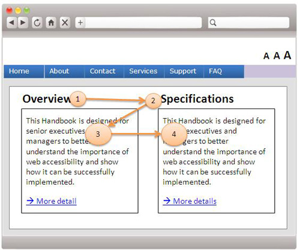
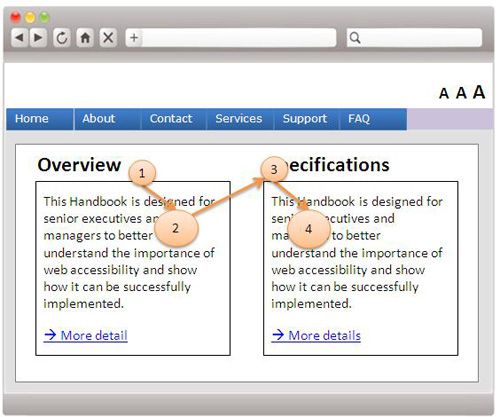
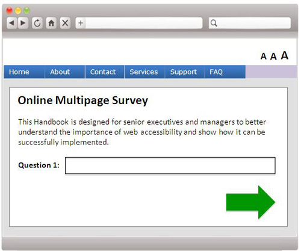
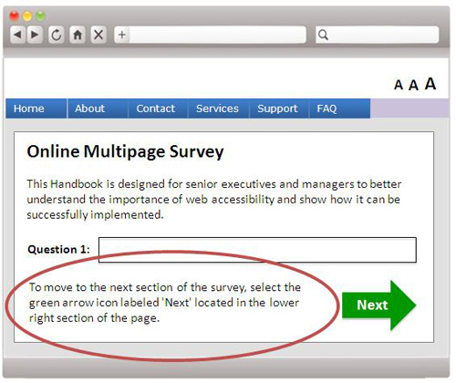

# 1.3 적응성

콘텐츠 제공자는 정보나 구조의 손상없이 접근성을 고려하여 다양한 방법으로 콘텐츠를 제공할 수 있도록 설계하여야 합니다.

> **프로그래밍 방식으로 확인**<br>
> 제공된 정보를 사용자 에이전트나 보조기기의 요청에 따라 프로그램을 통해 정보를 추출하여 동적으로 해석한 뒤 적합한 방식을 결정해 제공될 수 있도록 합니다.
> 마크업 언어 사용하는 것이 이에 포함됩니다.

## 1.3.1 정보와 관계 [A]

피제공자가 인식할 수 있는 구조, 콘텐츠는 프로그래밍 방식을 통해 관계를 확인한 뒤 배치되거나 직접 해석할 수 있는 텍스트로 제공되어야 합니다.

이를 통해 콘텐츠가 브라우저 및 보조기기를 통해 피제공자가 인식할 수 있는 환경에 맞춰 제공될 수 있습니다.

### 대상

- 장애 등의 이유로 다른 형태로 정보를 인식해야 하는 경우 보조기기등을 통해 원하는 형식으로 제공받을 수 있습니다.

### 예시

- 이미지를 대체 텍스트를 통해 표현하거나 접근성을 활용하기 위해 마크업을 해석하는 모든 일을 포함합니다.
- 대표적으로 표와 같은 도식을 프로그래밍 방식으로 구현할 경우 자료를 시각적인 방법 뿐만 아니라 다양한 방법으로 관계를 설명하고 제공할 수 있습니다.

## 1.3.2 유의미한 순서 [A]

콘텐츠의 인식에 순서가 영향을 주는 경우에는 올바른 인식을 할 수 있는 순서는 프로그래밍 방식을 통해 확인하여 제공되어야 합니다.

### 대상

- 콘텐츠를 선형으로 제공받을 때(스크린 리더 등) 그 과정에서 콘텐츠 내의 순서에 의해 그 의미나 내용이 훼손되어서는 안됩니다.

### 예시

- 다음과 같은 경우 마크업의 순서를 눈에 보이는대로 한다면 보조기기가 눈에 보이는 순서대로 콘텐츠를 제공해 피제공자가 혼란을 초래할 수 있습니다.<br>
  <br>
  마크업 순서를 논리적으로 진행하여 프로그래밍 방식에서도 원활이 이해할 수 있도록 합니다.<br>
  <br>

## 1.3.3 감각적인 특성 [A]

콘텐츠에 대한 올바른 이해를 위해 인식함에서 감각적인 특성(모양, 색상, 크기, 위치, 방향, 소리 등)에만 의존하지 않도록 합니다.

> 감각적 특성 중 색상에 대한 요구사항은 구별성과 연관된 지침으로 1.4.2 에서 추가적으로 설명해줍니다.

### 대상

- 특정 감각은 일부 피제공자에게 무의미하거나 인식하기 어렵기 때문에 명시적으로 인식할 수 있도록 해야합니다.
- 색을 통해 경고를 한다면 시각 장애를 가진 사람의 경우, 경고의 의미를 인식할 수 없기 때문에 명시적으로 경고함을 표현해야 합니다.

### 예시

- 페이지의 상단에 헤더를 배치한다고 해서 모든 피제공자가 그것을 헤더라고 인지할 수는 없기 때문에 마크업 단계에서 `<haeder>`등의 시멘틱 태그를 이용해 명시해야 합니다.
- UI 요소를 감각적인 특성에 의존한다면 일부 피제공자는 그 의미를 유추해야만 합니다.<br>
  <br>
  다음과 같이 정확히 UI 요소의 기능과 존재를 식별할 수 있는 방법을 명시하여 감각적인 특성에 의존을 하지 않게 해야 합니다.<br>
  <br>

## 1.3.4 방향 [AA]

콘텐츠의 인식에 있어 화면의 방향에 대한 특성이 필수적이지 않은 경우 모든 콘텐츠는 가로와 세로 모든 방향에서 인식할 수 있도록 제공되어야 합니다.

> 모바일 환경이 제공되면서 전통적으로 고정되어있던 화면이 방향이라는 특성을 가지게 되면서 WCAG2.1에서 추가된 성공 기준 중 하나입니다.

### 대상

- 장애 등으로 손을 활용하여 방향을 바꾸기 힘든 사람들에게는 어떤 방향에서도 동일하게 인식할 수 있어야 합니다.
- 시력 등의 문제로 가로폭이 넓은 화면에서 컨텐츠를 인식하는게 편한 사람들에게는 화면의 방향이 가로로 되어있어도 동일하게 인식할 수 있어야 합니다.

### 예시

- 이북 리더기에서는 세로읽기와 가로읽기를 모두 지원해야 한다.

## 1.3.5 입력 목적 식별 [AA]

피제공자로부터 정보를 수집하기 위해 입력을 받는 필드는 다음의 경우 프로그래밍 방식을 통해 확인되어야 합니다.

- 입력 필드가 UI 구성요소 관점에서 식별된 용도로 사용되어야 합니다.
  - 입력 필드별로 용도에 맞는 UI 구성요소를 피제공자의 환경에 맞추어 제공될 수 있도록 합니다.
  - `<input>`태그의 `type` 속성 값을 통해 해당 입력 필드의 기능을 프로그래밍 방식으로 선택하여 제공할 수 있습니다.
- 입력할 데이터에 대해 예상되는 의미를 식별할 수 있는 기술을 구현해야 합니다.
  - 입력할 데이터를 미리 준비하여 자동완성 등의 기술을 통해 최소한의 인지, 언어능력을 통해 올바른 정보를 수집할 수 있습니다.
  - `<input>`태그의 `autocomplete` 속성 값을 통해 자동완성 될 정보를 프로그래밍 방식으로 선택하여 제공할 수 있습니다.
    > 각 태그의 속성 값은 임의로 할당하는 것이 아닌 프로그래밍 방식으로 해석가능한 정보가 미리 지정되어 있으며, autocomplete의 속성 값 정보는 [W3C HTML 5.2 Autofill](https://www.w3.org/TR/html52/sec-forms.html#sec-autofill) 표에서 확인할 수 있습니다.

### 대상

- 인지, 언어 장애가 있는 피제공자가 올바른 정보를 입력하는 것을 돕습니다.
- 언어 및 기억장애가 있는 사용자는 자동완성의 특성을 통해 쉽게 올바른 정보를 찾을 수 있습니다.
- 입력 필드에 용도를 식별할 수 있는 아이콘등을 추가하여 해당 필드의 용도를 인식하는 데에 도움을 줄 수 있습니다.
- 운동 장애가 있는 사람들의 움직임을 자동완성 기능을 통해 최소화 할 수 있습니다.

### 예시

## 1.3.6 목적 식별 [AAA]

마크업으로 구현된 콘텐츠에서 UI의 구성요소, 아이콘, 영역의 역할과 목적은 프로그래밍 방식을 통해 확인될 수 있어야 합니다.

> 대표적인 방법으로는 WAI-ARIA의 `role` 속성을 통해 해당 UI 구성요소의 역할을 지정하고 `aria-label`, `aria-labelledby` 속성을 통해 목적을 명시함 으로 프로그래밍 방식으로 확인할 수 있도록 설계하는 것입니다.

### 대상

- 인지장애 등으로 콘텐츠 내의 UI 구성요소, 아이콘, 영역등의 목적을 구분하기 어려울 경우 다양한 대체 수단 통해 인식에 도움을 줄 수 있습니다.

### 예시

- 팝업창의 닫기 버튼에 정확한 목적을 프로그래밍 방식으로 부여하여 정확히 닫기 버튼이라는 목적을 알려줄 수 있습니다.

  ```html
  <button type="button" class="button close-modal" aria-label="닫기">X</button>
  ```

- 페이지 내의 각 영역의 역할을 명시하여 현재 확인하고 있는 콘텐츠의 목적을 더 명료하게 알 수 있습니다.

## 참고 자료

- [홍콩 사무국](https://www.ogcio.gov.hk/en/our_work/community/web_mobileapp_accessibility/promulgating_resources/handbook/wcag2a/8_7_sensory_characteristics.html)
- [Understanding Success Criterion 1.3.1: Info and Relationships](https://www.w3.org/WAI/WCAG21/Understanding/info-and-relationships.html)
- [Understanding Success Criterion 1.3.2: Meaningful Sequence](https://www.w3.org/WAI/WCAG21/Understanding/meaningful-sequence.html)
- [Understanding Success Criterion 1.3.4: Orientation](https://www.w3.org/WAI/WCAG21/Understanding/orientation.html)
- [모두를 위한 디자인 - 1.3 적응성](https://a11y.gitbook.io/wcag/1-perceivable/1.3-adaptable)
- [Understanding Success Criterion 1.3.5: Identify Input Purpose
  ](https://www.w3.org/WAI/WCAG21/Understanding/identify-input-purpose.html)
- [Understanding Success Criterion 1.3.6: Identify Purpose](https://www.w3.org/WAI/WCAG21/Understanding/identify-purpose.html)
