# 1.4 구별성

시각, 청각적인 요소가 피제공자에게 충분히 구별/분리되어 인식할수 있도록 콘텐츠를 제공해야 합니다.

## 1.4.1 색상 사용 [A]

정보 전달, 행동 지시, 반응을 유발하는 시각요소를 인식할 수 있는 방법이 색상에 의존하면 안됩니다.

> 해당 성공 기준은 감각적인 특성에 대한 성공 기준을 서술한 1.3.3 의 색상에 대한 내용만을 구체적으로 다룹니다.

### 대상

- 시력이 있으나 기능 저하, 색맹 등의 문제로 색상의 구별이 어려운 경우 색상으로만 정보를 제공한다면 식별하기 어렵습니다.
- 제한된 색상을 표현하는 디스플레이를 사용하는 피제공자에게는 색상에 의존하는 정보를 올바르게 식별하기 어렵습니다.

### 예시

- 도표를 표현할 때 각 분류를 색상에 의존하게 된다면 일부 피제공자는 해당 분류를 구별할 수 없습니다.
  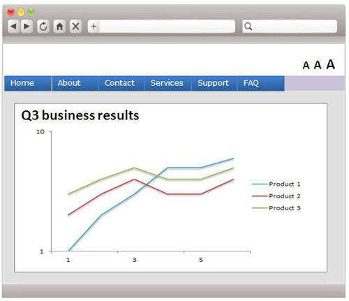
  다음과 같이 도형등의 추가적인 요소를 통해 분류를 구별할 수 있도록 합니다.
  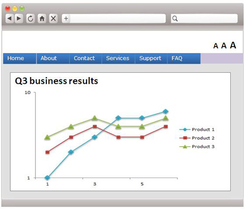

## 1.4.2 소리 제어 [A]

웹 페이지 내에서 소리가 자동으로 3초이상 재생되는 경우에는 해당 소리를 일시정지 혹은 정지 할수 있도록 하거나 음량을 조절할 수 있는 기능을 제공해야 합니다.

> 해당 성공 기준은 충족하지 못할 경우 다른 모든 컨텐츠를 인식함에 방해가 되기 때문에 해당 준수 수준으로 평가 받기 위해서는 다른 지침과 별개로 반드시 충족해야 합니다.

### 대상

- 스크린 리더등 대체 콘텐츠로 청각을 이용해야 하는 경우 제어할 수 없는 소리로 인해 혼란을 초래하게 됩니다.
- 음성 컨텐츠 등을 처리하는 데에 집중할 수 있게 합니다.

### 예시

- 콘텐츠의 배경음이 흐르지만 ESC키를 누르는 등의 동작으로 배경음을 바로 중단할 수 있도록 합니다.
- 가능하면 배경음을 넣지 않는 것이 좋습니다.

## 1.4.3 최소 명도대비 [AA]

텍스트 및 화상 텍스트의 시각적인 표현을 위해서는 최소한 4.5:1 이상의 명도대비율을 가져야 한다. 단 다음과 같은 경우는 제외됩니다.

> 명도대비는 `가장 밝은곳의 상대휘도 : 가장 어두운곳의 상대휘도`로 표현하며 완전한 흑백 기준으로 최대 21:1까지 표현할 수 있습니다

- 커다란 (18pt 혹은 굵은 14pt 이상) 텍스트
  - 이 경우에는 최소한 3:1 이상의 명도대비율을 가져야 합니다.
  - px이 아닌 pt이기 때문에 ppi를 통해 현실세계의 크기를 계산해야 합니다
- 일부 비활성된 요소의 텍스트, 의미 없는 텍스트, 시각적 콘텐츠 내에 일부 포함된 텍스트는 명도대비에 대한 요구가 없습니다.
- 로고 또는 상표에는 명도대비에 대한 요구가 없습니다.

### 대상

- 시력이 낮거나, 색맹, 난독 등의 문제로 문장의 전경과 배경의 구분이 어려우면 처리에 불편, 혼란을 초래하거나 심할 경우 인지 자체가 안될 수 있습니다.

### 예시

- 다음과 같은 텍스트의 명도대비는 3.14:1 로 시인성이 좋지 않습니다.
  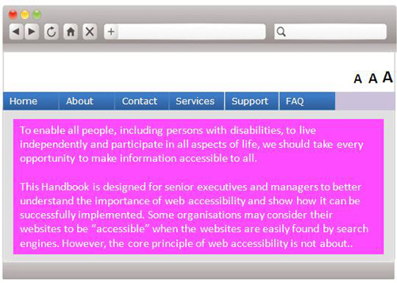
  다음과 같이 일반적인 하얀바탕에 검은글씨를 사용해 21:1의 명도비로 표현해 줄 수 있습니다.
  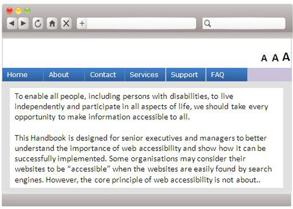

## 1.4.4 텍스트 크기 조정 [AA]

콘텐츠나 기능의 손상 없이 텍스트(화상 텍스트와 자막은 제외)를 사용자 에이전트에 의존하지 않고 자체적으로 200%까지 크기를 조절할 수 있는 기능을 제공해야 합니다.

### 대상

- 저시력자가 사용자 에이전트의 추가기능, 보조기기의 의존 없이 콘텐츠를 쉽게 인식할 수 있게끔 크기를 늘려 시인성을 확보합니다.

### 예시

- 다음과 같은 텍스트는 일부 피제공자에게 너무 작게 느껴질 수 있습니다.
  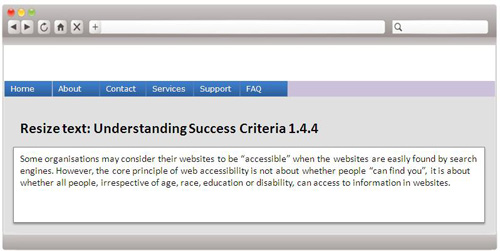
  다음과 같이 최대 200%까지 텍스트의 크기를 조절할 수 있는 기능을 추가하여 접근성을 확보합니다.
  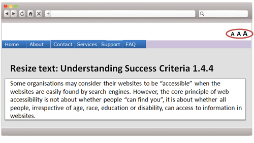

## 1.4.5 화상 텍스트 [AA]

장식, 의미부여의 목적으로 텍스트를 변형하여 화상 텍스트로 표현할 때 시각적인 접근이 가능한 환경이라도, 화상 텍스트의 시각적인 요소를 세부적으로 사용자화 기능을 제공해야 합니다.

로고나 상표와 같이 텍스트의 시각적인 표현이 필수인 경우를 제외하면 화상 텍스트 사용은 지양하여야 합니다.

### 대상

- 시력이 낮거나 인지 능력이 낮아 텍스트의 형태나 색상의 변형 등으로 텍스트를 인식하기 어려운 경우, 형태나 색상을 피제공자가 설정할 수 있게 하거나 별도의 변형을 하지 말아야합니다.

### 예시

- 머리말의 장식을 위해 화상텍스트를 이용했지만 경우에 따라 인식에 혼란을 줄 수 있습니다.
  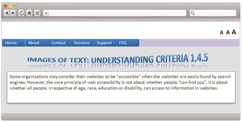
  다음과 같이 일반 텍스트로 사용하면 모든 피제공자가 불편함 없이 인식할 수 있습니다.
  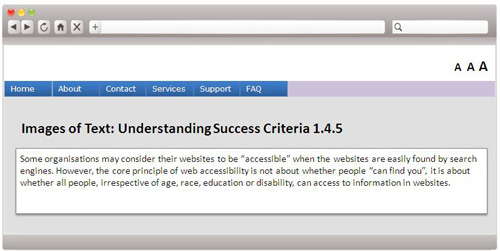

## 1.4.6 향상된 명도대비 [AAA]

> 1.4.3 성공 기준에서 더 향상된 기준을 제시하는 성공 기준입니다.
> **1.4.3 성공 기준과 목적과 예시는 동일하므로 생략합니다.**

텍스트 및 화상 텍스트의 시각적인 표현을 위해서는 최소한 7:1 이상의 명도대비율을 가져야 합니다. 단 다음과 같은 경우는 제외됩니다.

- 커다란 (18pt 혹은 굵은 14pt 이상) 텍스트
  - 이 경우에는 최소한 4.5:1 이상의 명도대비율을 가져야 합니다.
  - px이 아닌 pt이기 때문에 ppi를 통해 현실세계의 크기를 계산해야 합니다
- 일부 비활성된 요소의 텍스트, 의미 없는 텍스트, 시각적 콘텐츠 내에 일부 포함된 텍스트는 명도대비에 대한 요구가 없습니다.
- 로고 또는 상표에는 명도대비에 대한 요구가 없습니다.

## 1.4.7 작은 배경음 또는 배경음 없음 [AAA]

- 사용자가 듣기 위해 재생한 소리(이하 전경음)인 경우
- 캡챠 혹은 오디오의 로고가 아닌 경우
- 음성을 음악적 요소로 이용한 경우가 아닌 경우

위 세가지 사항에 모두 부합하는 사전 녹음된 음성 콘텐츠는 아래의 조건 중 하나 이상을 충족해야만 합니다.

- 소리에 배경음 없이 음성만 있어야 합니다.
- 배경음이 있다면 피제공자가 차단할 수 있어야 합니다.
- 1~2초 간헐적으로 지속되는 소리를 제외하면 배경음은 전경음보다 최소 20dB 낮아야 합니다. (데시벨 정의에 따라 4배 이상 조용해야 합니다.)

### 대상

- 난청등의 이유로 배경음과 전경음의 분리가 어려운 경우 구분을 명확히 해야 합니다.

### 예시

- 분위기등의 이유로 배경음을 깔은 영상의 배경음이 너무 큰 경우에는 배경음만 줄일 수 있도록 하거나 배경음을 넣지 않거나, 배경음을 전경음의 4배 이상 조용해야 합니다.
- 노래, 랩은 배경에서 들리는 소리가 예술적인 의미를 함께 전달하기 때문에 제한이 없습니다.

## 1.4.8 시각적 표현 [AAA]

텍스트 영역을 시각적으로 표현하기 위해서는 아래의 조건을 충족하거나, 다음과 같이 설정할 수 있는 기능을 제공해야 합니다.

- 피제공자가 직접 텍스트의 배경색과 글자색을 지정할 수 있어야 합니다.
- 가로폭 안에 80자 (한글, 가나, 한자 40자) 이하로 들어가야 합니다.
- 텍스트는 양쪽정렬(justify)가 아니어야 합니다.
- 행간(line-height)는 글자 높이의 1.5배 이상이어야 합니다.
- 전체화면에서 텍스트의 크기가 보조기기나 사용자 에이전트의 의존 없이 200% 까지 확대되어도 수평 스크롤이 생기지 않도록 해야 합니다.

### 대상

- 일부 인지장애의 경우 텍스트의 구조가 산만하거나 가독성이 떨어지는 경우 인식에 불편이 있을 수 있습니다.

### 예시

- 시각적 표현 성공 기준을 지키지 않은 경우 인식이 불편할 수 있습니다.
  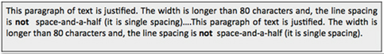
  다음과 같이 시각적 표현 성공 기준을 지키게 되면 가독성이 높아져 모든 사용자가 불편없이 인식할 수 있습니다.
  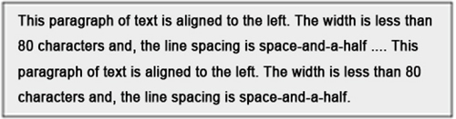

## 1.4.9 엄격한 화상 텍스트 [AAA]

> 1.4.5 성공 기준에서 예외를 더 엄격한 기준을 제시하는 성공 기준입니다.
> **1.4.5 성공 기준과 예시는 동일하므로 생략합니다.**

시각적인 접근이 가능한 환경이라도, 로고나 상표와 같이 텍스트의 시각적인 표현이 필수인 경우를 제외하면 화상 텍스트 사용은 사용하지 않습니다.

### 대상

- 설정 가능한 화상 텍스트의 설정에 불편을 겪을수 있기 때문에 가능한 화상 텍스트를 사용하지 않아야 합니다.

## 1.4.10 재배치 [AAA]

> **CSS픽셀**
> 컴퓨터 내에서 계산된 픽셀이 아닌 현실 세계에서 96PPI(1인치 내에 96\*96개의 픽셀이 존재)를 기준으로 시청거리를 함께 계산한 픽셀 단위로 0.0213도의 시야각을 채우면 1 CSS픽셀로 계산합니다.

콘텐츠는 다음의 가로폭/세로폭을 가진 환경에서도 구성을 재배치하여 흐름의 진행 방향과 교차되는 방향으로 스크롤이 생겨서는 안됩니다.

- 수직으로 진행되는 가로폭 320 CSS픽셀의 콘텐츠
- 수평으로 진행되는 세로폭 256 CSS픽셀의 콘텐츠

### 대상

- 시각적인 이유에서 화면을 확대해야 하거나, 다양한 기기의 사이즈에 맞춰 현실세계에서 시인성과 사용성을 확보하기 위해서는 콘텐츠가 확대되어도 진행방향 축으로 스크롤 되어야 합니다.

### 예시

- 반응형 사이트들은 기기의 CSS픽셀에 맞춰 콘텐츠를 재배치하여 제공합니다.

## 1.4.11 비 텍스트 콘텐츠의 명도대비 [AA]

콘텐츠 내의 텍스트가 아닌 UI 요소, 그래픽 등과 같은 시각적인 표현은 인접한 색상과의 명도대비가 최소한 3:1 이상이어야 하고 모든 요소의 경계가 명확히 표시되어 있어야 한며 상태의 변화 또한 명확하게 구분되어야 합니다.

UI 요소의 경우는 비활성 요소 혹은 요소를 제공자가 직접 수정하지 못하는 경우, 그래픽 요소의 의미가 명도대비가 높아지면 정보가 손상이 되는 경우는 제외합니다.

### 대상

- 시력이 낮거나, 색맹, 인지 장애 등의 문제로 구성요소, 그래픽의 전경과 배경의 구분과 상태변화의 구분이 어려우면 인식에 불편, 혼란을 초래하거나 심할 경우 인식 자체가 안될 수 있습니다.

### 예시

- (좌)버튼의 텍스트의 명암비는 확보되었지만 해당 구성요소를 구분하기는 어렵다. 그렇기 때문에 (우)버튼처럼 테두리를 이용해 경계를 표현해 줍니다.
  

<!-- - UI 구성 요소에서 인접색상은 구성 요소에서 인접한 색상을 의미한다. 다음과 같은 입력필드의 흰색 배경과 외부의 흰색 배경의 명도대비가 1:1이다.
  
  다음과 같이 배경에 명도대비 3:1 이상의 색상을 지정하여 명도대비를 높인다.
   -->

- 다음의 별점 UI 구성요소는 내용을 완전히 채우거나, 경계 두께의 차이를 줘서 상태를 확실하게 구별합니다.
  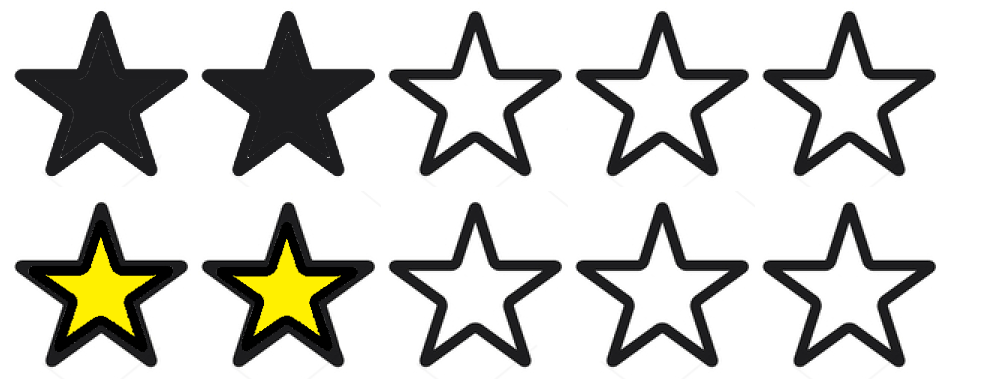

  그러나 다음의 별점 UI 구성요소는 단순히 색으로만 차이를 뒀으나, 색의 명도대비가 1.2:1로 매우 적기 때문에 적합하지 않습니다.
  

- UI 구성요소의 상태에 따라 명확하게 상태가 구별되어야 합니다.
  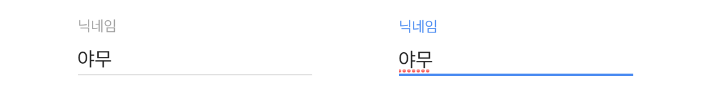

## 1.4.12 텍스트 간격 [AA]

마크업 언어의 텍스트 스타일 속성을 다음과 같이 별도로 지정하여도 추가적인 스타일 속성 변경을 하지 않아도 콘텐츠의 기능의 손상이 없어야 합니다.

- 줄 간격이 글자 크기의 최소 1.5배 이상 (line-height 속성)
- 문단 간격이 글자 크기의 최소 2배 이상 (margin-block-start, margin-block-end 속성)
- 글자 간격이 글자 크기의 최소 0.12배 이상 (letter-space 속성)
- 단어 간격이 글자 크기의 최소 0.16배 이상 (word-space 속성)

해당 성공 기준은 프로그래밍적인 확인을 통해 결정할 수 있는 텍스트 콘텐츠에만 해당하며 PDF, 이미지 텍스트, Canvas요소 등은 예외입니다.

### 대상

- 저시력, 난독 등은 줄 간격, 문단 간격, 글자 간격, 단어 간격등의 요소가 문장을 이해하는데에 큰 영향을 준다. 피제공자는 사용자 에이전트, 보조기기등을 통해 간격을 콘텐츠의 손상없이 직접 조절할 수 있게 제공해야 합니다.

### 예시

- 아래의 실패 사례를 방지해야 합니다.
  - 세로 텍스트 가려짐: 간격을 조절했지만 컨테이너가 함께 늘어나지 않거나 다음 텍스트가 내려가지 않아 조절한 텍스트의 내용이 가려집니다.
    
  - 가로 텍스트 가려짐: 간격을 조절했지만 컨테이너가 함께 늘어나지 않거나 다음 텍스트가 옆으로 비키지 않아 조절한 텍스트의 내용이 가려집니다.
    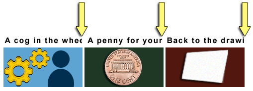
  - 텍스트 겹침: 간격을 조절했지만 적절한 재배치를 하지 못해 텍스트가 서로 겹쳐 보이게 됩니다.
    

## 1.4.13 마우스 / 키보드를 통해 접근하는 콘텐츠 [AA]

마우스 포인터를 통해 가르킬 때(hover) 혹은 키보드를 통해 요소를 지목할 때(focus) 콘텐츠가 추가되고 상태를 해제할 경우 콘텐츠가 숨겨지는 기능에는 다음 조건이 요구됩니다.

- 콘텐츠가 추가된 상태에서도 닫을 수 있어야 합니다.
- 호버되어 추가된 콘텐츠를 호버시에도 상태가 유지되어야 합니다.
- 추가 콘텐츠를 다시 숨기는 의도가 없는 한 유지되어야 합니다.

또한 마우스 포인터를 통해 가르킬 때와 키보드를 통해 요소를 지목 할 때 모두 추가 콘텐츠를 제공해야 합니다.

> 단 사용자 에이전트에 의해 제어되는 추가 콘텐츠의 표시(예: HTML title로 표시되는 툴팁)은 예외입니다.

### 대상

- 접근성 목적으로 시야가 제한된 환경에서 필요한 경우에만 추가적인 콘텐츠를 볼 수 있게 해줍니다.
- 보조기기나 운영체제의 설정을 통해 마우스의 커서를 키워 커서가 추가 콘텐츠를 가려도 가려진 영역의 콘텐츠를 보기위해 커서를 옮겨도 유지될 수 있게 할 수 있습니다.
- 포인터 정확도가 낮은 피제공자가 잘못 가져간 포인터로 인해 추가 콘텐츠가 보여도 바로 숨길 수 있습니다.

### 예시

- 다음과 같은 경우는 실패사례로, 마우스로 호버시에는 추가 콘텐츠가 제공되지만 키보드 포커스시에는 추가 콘텐츠가 제공되지 않습니다.
  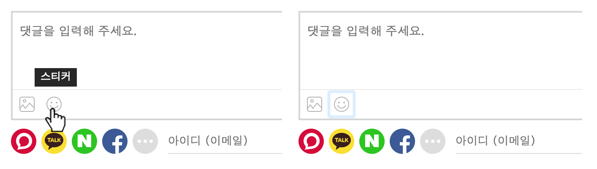
- 콘텐츠가 호버로 추가되었으나 포인터에 의해 가려졌습니다. 하지만 포인터를 추카 콘텐츠 위에서 이동해도 콘텐츠가 유지되기 때문에 콘텐츠를 제대로 확인할 수 있습니다.
  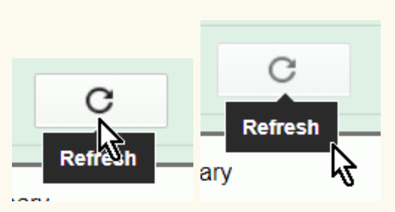

## 참고 자료

- [홍콩 사무국](https://www.ogcio.gov.hk/en/our_work/community/web_mobileapp_accessibility/promulgating_resources/handbook/wcag2a/8_7_sensory_characteristics.html)
- [호주 시각장애 단체](https://www.visionaustralia.org)
- [모두를 위한 디자인 - 1.4 명료성](https://a11y.gitbook.io/wcag/1-perceivable/1.4-distinguishable)
- [Understanding Success Criterion 1.4.3: Contrast (Minimum)](https://www.w3.org/WAI/WCAG21/Understanding/contrast-minimum.html)
- [Understanding Success Criterion 1.4.4: Resize text
  ](https://www.w3.org/WAI/WCAG21/Understanding/resize-text.html)
- [Understanding Success Criterion 1.4.7: Low or No Background Audio
  ](https://www.w3.org/WAI/WCAG21/Understanding/low-or-no-background-audio.html)
- [Understanding Success Criterion 1.4.8: Visual Presentation
  ](https://www.w3.org/WAI/WCAG21/Understanding/visual-presentation.html)
- [Understanding Success Criterion 1.4.10: Reflow
  ](https://www.w3.org/WAI/WCAG21/Understanding/reflow.html)
- [Understanding Success Criterion 1.4.11: Non-text Contrast
  ](https://www.w3.org/WAI/WCAG21/Understanding/non-text-contrast.html)
- [Understanding Success Criterion 1.4.12: Text Spacing](https://www.w3.org/WAI/WCAG21/Understanding/text-spacing.html)
- [Understanding Success Criterion 1.4.13: Content on Hover or Focus](https://www.w3.org/WAI/WCAG21/Understanding/content-on-hover-or-focus.html)
