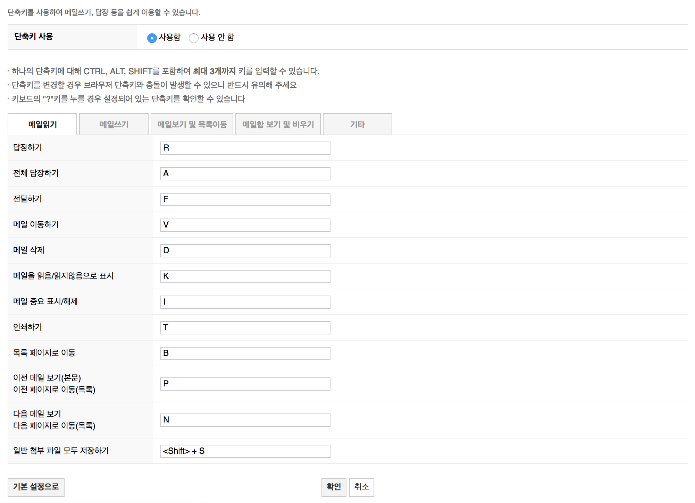

# 2.1 키보드 접근(Keyboard)

키보드로 모든 기능을 사용할 수 있어야 합니다.

## 2.1.1 키보드 [A]

콘텐츠의 모든 기능은 사용자 이동 경로에 따라 달라 지는 입력을 요구하는 경우를 제외하고 개별 키 입력에 대한 특정한 타이밍을 요구하지 않는 키보드 인터페이스를 통해 작동할 수 있어야 합니다.

> 예외사항은 입력 기술이 아니라, 기본 기능과 관련이 있습니다. 예를 들어 필기를 사용하여 텍스트를 입력하는 경우 입력 기술(필기)은 경로 의존적인 입력이 필요하지만, 기본 기능(텍스트 입력)은 그렇지 않습니다.
> 키보드 조작으로 인해 마우스 입력 또는 기타 입력 방법 사용에 제한이 있어서는 안됩니다.

### 대상

- 저시력자, 시각 장애를 가진 사람
- 손떨림으로 인해 마우스 대신 키보드를 사용하는 사람
- 마우스를 사용할 수 없는 사람

### 예시

- `Tab`과 `Enter`키 등을 이용해서 웹페이지의 모든 기능을 조작할 수 있습니다.

## 2.1.2 키보드 함정 제거 [A]

키보드 인터페이스를 사용하여 키보드 포커스를 페이지 컴포넌트로 이동할 수 있는 경우 키보드 인터페이스만 사용하여 해당 컴포넌트에서 포커스를 이동할 수 있어야 합니다. 사용자가 화살표 또는 탭 키 또는 기타 표준 종료 방법을 사용할 경우, 사용자는 포커스를 멀리 이동시키는 방법에 대해 안내해야 합니다. 즉, 웹 페이지 콘텐츠의 하위 섹션 내에서 키보드 포커스가 '해제할 수 없는 상태(trap)'에 빠지지 않도록 해야 합니다.

> 이 성공기준을 충족하지 않는 콘텐츠는 전체 페이지 사용에 방해가 될 수 있으므로 웹 페이지의 모든 콘텐츠(다른 기준을 충족하는 지 여부와 상관 없이)는 이 성공기준을 준수해야 합니다.

### 대상

- 키보드를 사용하는 사람

### 예시

- 모달 대화 상자가 열리면 포커스가 해당 대화 상자 내에 갇히고, 대화 상자의 마지막 컨트롤에서 탭하면 포커스는 대화 상자 내의 첫 컨트롤로 이동합니다. 대화 상자 아래의 확인 또는 취소 버튼을 누르면 대화 상자가 사라집니다.
  

## 2.1.3 키보드: 예외 없음 [AAA]

콘텐츠의 모든 기능은 개별 키 입력에 대한 특정 시간종료(timeout)을 요구하지 않고 키보드 인터페이스를 통해 작동 가능해야 합니다. 즉, 키보드로 모든 콘텐츠를 작동할 수 있어야 합니다.

### 대상

- 저시력자, 시각 장애를 가진 사람
- 손떨림으로 인해 마우스 대신 키보드를 사용하는 사람
- 마우스를 사용할 수 없는 사람

### 예시

- 아래 그림에서는 마우스를 통해서만 그리기가 가능합니다. 마우스를 사용할 수 없는 사람은 접근할 수 없습니다.
  .jpg>)
  <br>
  키보드로도 그리기 기능을 제공하며 어떻게 기능을 사용할 수 있는지 설명이 추가된 예시입니다.
  .jpg>)

## 2.1.4 문자 키 단축키 [A]

키보드 단축키를 문자(대소문자 포함), 구두점, 숫자 또는 기호 문자만 사용하여 콘텐츠에 구현할 경우 다음 중 하나 이상을 준수해야 합니다. 단축키를 제공해야 한다면 출력 가능한 단일 문자에 기능을 맵핑하지 않는 것이 좋습니다.

- 단축키 기능 비활성화(Turn off)
  단축키를 끌 수 있는 기능을 제공해야 합니다.

- 단축키 재설정(Remap)
  1개 이상 프린트 할 수 없는 키보드 문자(예: Ctrl, Alt 등)를 사용하도록
  단축키를 재설정할 수 있는 기능을 제공해야 합니다.

- 포커스 상태에서만 활성화(Active only on focus)
  UI 컴포넌트 단축 키는 해당 컴포넌트에 포커스가 있을 때만 활성화됩니다.

- HTML 요소에 accesskey 속성을 사용한 경우는 예외  
   이 성공 기준은 문자 키를 사용하여 구현된 단축 키의 경우만 적용됩니다. HTML `accesskey` 속성을 사용하는 경우 웹 브라우저의 ‘Alt, Ctrl, Shift’ 등 출력 불가능한 키와 조합하여 사용할 수 있습니다. accesskey 실행 방식은 브라우저마다 다르며 Alt+S, Ctrl+Alt+S, Alt+Shift+S 등으로 실행 가능합니다.
  [MDN- accesskey](https://developer.mozilla.org/ko/docs/Web/HTML/Global_attributes/accesskey)
  ```html
  <input type="search" accesskey="s" title="검색" />
  <!--accesskey를 실행하면 폼 콘트롤 요소로 키보드 초점이 이동합니다. -->
  <a href="/site-index.html" accesskey="S">Site Index</a>
  <!--하이퍼링크에 accesskey를 설정하면 accesskey 실행 즉시 페이지가 이동됩니다. -->
  ```

### 대상

- 음성 입력 사용자
- 키보드 사용자 (실수로 키를 입력하는 경우)
- 인지 장애가 있는 사람 (단축키 재설정으로 여러 사이트에서 동일한 기능 키를 설정할 경우 도움이 될 수 있습니다)

### 예시

- 트위터에서 `James`를 입력하기 위해 말하는 순간, ‘j-a-m-e-s’ 키보드가 차례로 눌리고 ‘j, a, m, e, s’ 문자에 할당된 명령을 차례로 실행합니다. `j`와 `m`은 단축 키로 지정되어 있기 때문에 'es' 에게 메세지 보내는 창이 뜨는 결과를 보입니다. 즉, `j` 단축키로 한 항목 아래로 이동하고, `m` 단축키로 메세지 대화 상자를 열고 나머지 `es`가 받는 사람 칸에 입력된 것입니다.
  [](https://www.youtube.com/watch?v=OPjfpDU9S08&t=2s)

- NAVER 메일은 사용자 편의를 위해 몇 가지 단축키를 제공합니다. 예를 들어 R 키를 눌러 읽은 메일에 답장을 하거나, D 키를 눌러 메일을 삭제할 수 있습니다. 이 때, 단축키가 문자로만 이루어졌기 때문에 음성 입력 사용자에게 문제가 있을 수 있습니다. 즉 사용자가 하나 이상 문자 단축 키와 일치하는 단어를 말할 때 컨트롤에 포커스가 있으면 예기치 않은 동작이 발생합니다. 네이버에서는 단축키 기능을 켜거가 끌 수 있고, 단축키를 재설정할 수 있는 기능을 제공합니다.
  

## 참고 자료

- [WCAG 2.1 Guidelines Explained with Examples](https://www.c2experience.com/blog/wcag-21-guidelines-explained-with-examples)
- [a11y WCAG 2.1 gitbook](https://a11y.gitbook.io/wcag/2-operable/2.1-keyboard-accessible)
- [Understanding Success Criterion 2.1.1](https://www.w3.org/WAI/WCAG21/Understanding/keyboard.html)
- [Understanding Success Criterion 2.1.2](https://www.w3.org/WAI/WCAG21/Understanding/no-keyboard-trap.html)
- [Understanding Success Criterion 2.1.3](https://www.w3.org/WAI/WCAG21/Understanding/keyboard-no-exception.html)
- [Understanding Success Criterion 2.1.4](https://www.w3.org/WAI/WCAG21/Understanding/character-key-shortcuts.html)
- [WCAG 2.1 새로운 성공 기준 소개 - naradesign](https://naradesign.github.io/wcag-2.1.html)
