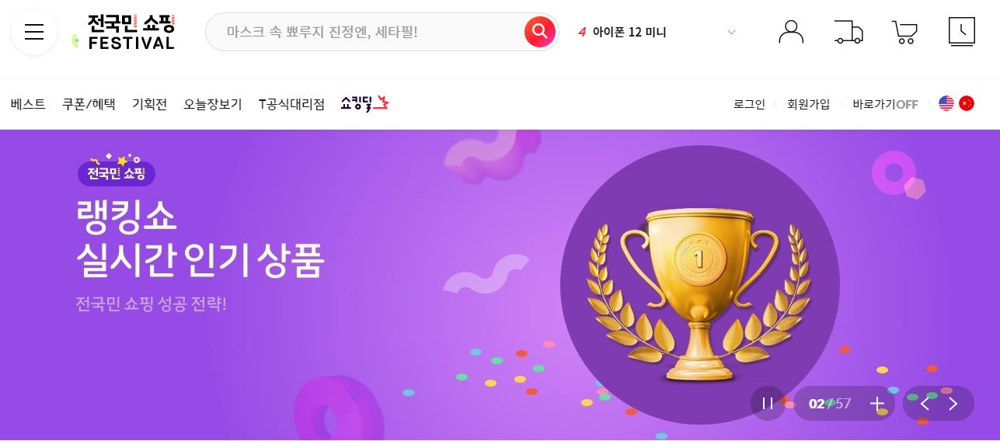
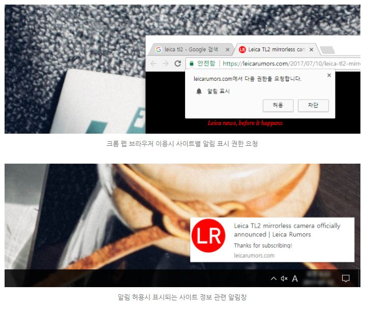
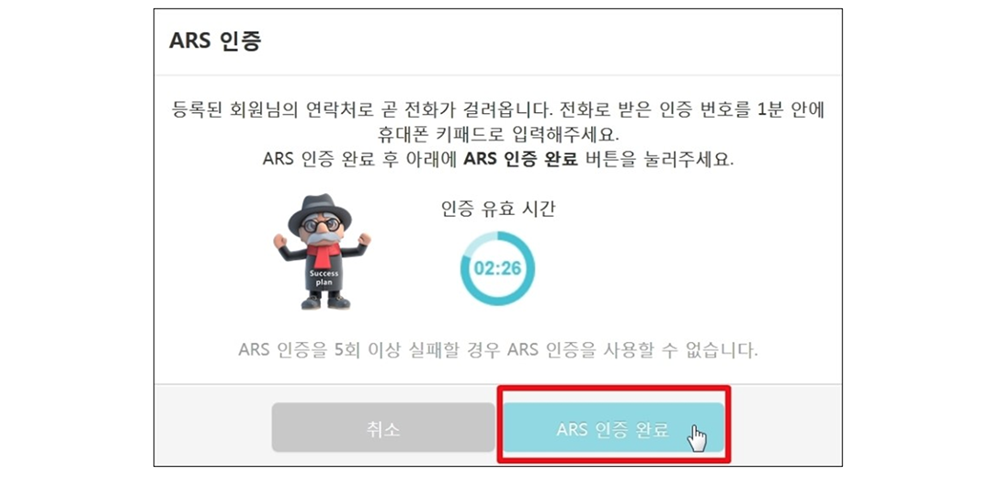
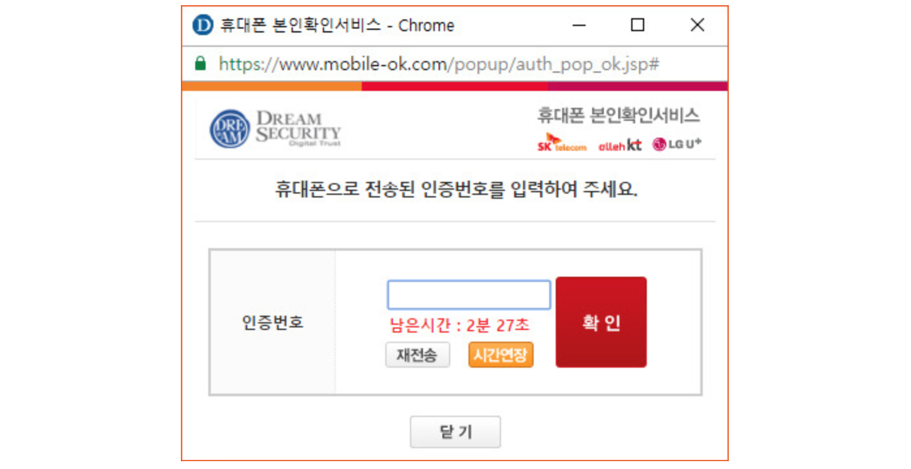

# 2.2 충분한 시간 제공(Enough Time)

사용자가 콘텐츠를 읽고 사용할 수 있도록 충분한 시간을 제공해야 합니다.

## 2.2.1 시간 제한 조정 가능 [A]

콘텐츠에 의해 설정된 시간 제한의 경우, 다음 중 하나 이상을 준수해야 합니다.

- 시간 제한 해제(Turn off)
  사용자는 시간 제한을 해제 할 수 있습니다.

- 시간 제한 조정(Adjust)
  사용자는 기본 설정 길이의 10배 이상인 넓은 범위에서 제한 시간을 조정할 수 있습니다.

- 시간 제한 연장(Extend)
  사용자는 시간이 만료(최소 20초)되기 전 간단한 동작(예: 스페이스바를 누르시오)을 통해 시간 제한을 최소 10회 이상 연장할 수 있습니다.

- 실시간 예외(Real-time Exception)
  시간제한이 필수적이며 이에 대한 다른 대안이 없는 실시간 이벤트(예: 경매)의 경우는 예외입니다.

- 필수 예외
  시간 제한이 필수적이며 이를 연장하면 활동이 무효화되는 경우는 예외입니다.(선착순 온라인 티켓 구매 사이트)

- 20시간 예외
  제한 시간이 20시간을 초과하는 경우는 예외입니다.

### 대상

- 스크린 리더기를 사용하여 정보를 이해하고 컨트롤 하는데 많은 시간이 필요한 사람
- 읽기 장애, 지각 장애, 학습 장애가 있는 사람
- 콘텐츠를 이해하는데 오랜 시간이 필요한 사람

### 예시

- 은행에서 자동로그아웃 전, 시간 제한을 연장할 수 있는 기능을 제공합니다.
  

- 11번가 메인 페이지 비주얼 영역의 정보가 변경되는 시간이 짧은 사용자를 위해 일시정지 버튼을 제공하여 정보를 충분히 확인할 수 있게 합니다.
  

## 2.2.2 일시정지, 중지, 숨김 [A]

자동으로 업데이트되는 정보 이동, 깜빡임, 스크롤링의 경우 다음 사항이 모두 요구됩니다. 깜빡이는 콘텐츠는 사용자의 관심을 끄는 효과적인 기술이지만 지속될 경우 일부 사용자에게 문제가 될 수 있습니다.

- 이동, 깜빡임, 스크롤링(Moving, blinking, scrolling)
  이동, 깜박임 또는 스크롤 정보의 경우 일시정지, 중지 또는 숨김 기능을 제공해야 합니다. (자동으로 시작되고, 5초 이상 지속되며, 다른 콘텐츠와 동시에 표시되는 콘텐츠가 필수적인 구성요소인 경우는 예외입니다)

- 자동 업데이트(Auto-updating)
  사용자가 자동 업데이트 정보를 일시정지, 중지 또는 숨김할 수 있는 기능 또는 업데이트 빈도를 조절할 수 있는 기능을 제공해야 합니다. (자동으로 시작하고, 다른 콘텐츠와 병행하여 표시되는 정보가 필수적인 구성요소인 경우는 예외입니다)

### 대상

- 주의력 결핍 장애를 가진 사람

### 예시

- 11번가 메인 페이지 비주얼 영역의 정보는 깜빡이며 자동으로 업데이트됩니다. 일시정지 버튼을 제공하여 사용자가 자동 업데이트를 중지할 수 있습니다.
  

## 2.2.3 시간제한 없음 [AAA]

비대화형(non-interactive) 동기화 미디어와 실시간 이벤트를 제외하고, 시간제한(timing)은 콘텐츠에 필수적으로 제공되어야 하는 이벤트나 활동이 아닙니다.

### 대상

- 스크린 리더기를 사용하여 정보를 이해하고 컨트롤 하는데 많은 시간이 필요한 사람
- 인지적 또는 언어적 한계가 있는 사람
- 콘텐츠를 이해하는데 오랜 시간이 필요한 사람

### 예시

- 시간 제한이 없는 시험
- 사용자가 실시간으로 경쟁하는 것이 아니라 교대로 경쟁할 수 있도록 만들어진 게임

## 2.2.4 작업방해 금지 [AAA]

긴급(응급) 상황과 관련된 작업방해(interruptions)을 제외하고, 사용자는 작업방해를 연기하거나 중단할 수 있어야 합니다.

### 대상

- 주의력 결핍 장애를 가진 사람(콘텐츠에 집중할 수 있습니다)
- 시력이 낮거나 스크린 리더기를 사용하는 사람(콘텐츠를 읽는 도중 다른 콘텐츠를 읽게 되면 중단 및 오해로 이어질 수 있습니다)

### 예시

- 크롬 브라우저에서 사이트 알림을 허용하면 아래와 같이 알림창이 표시됩니다. 콘텐츠 설정에서 사이트의 알림 허용을 변경할 수 있습니다.
  

## 2.2.5 재 인증 [AAA]

인증된 세션이 만료 되면, 사용자는 재 인증 후 데이터 손실 없이 지속적으로 콘텐츠를 이용할 수 있어야 합니다.

### 대상

- 인지장애가 있는 사람
- 콘텐츠를 읽고 이해하는데 상당한 시간이 필요한 사람

### 예시

- 메일 프로그램에서 인증 시간이 만료되기 전에 사용자에게 알려주고 재인증을 위한 새 창을 여는 링크를 제공합니다. 메일을 작성 중이던 원래 창은 그대로 유지되고, 재인증 후에 사용자는 작성했던 메일을 전송할 수 있습니다.
- 웹페이지에서 실시하는 설문조사의 경우, 부분적으로 완료된 폼을 저장할 수 있는 버튼을 통해 설문을 저장했다가 나중에 완료할 수 있는 기능을 제공합니다.

## 2.2.6 시간 종료 [AAA]

사용자가 아무런 행위를 하지 않아도 데이터를 20시간 이상 보존하지 않는다면, 데이터 손실이 가능한 사용자 비활동 기간을 사용자에게 알려야 합니다.

- 사용자가 휴식을 시작한 시점으로부터 20시간 이상 입력 데이터를 초기화하지 않습니다.
- 20시간 이상 데이터를 보존할 수 없다면 언제 데이터가 삭제되는지 사용자에게 미리 알려야 합니다.
- 사용자가 사이트를 떠나거나 브라우저 창을 닫으면 타이머를 중단합니다.

> 개인 정보 보호 법에 따라 사용자 식별과 데이터 저장을 위해 사용자 동의가 필요할 수 있습니다. 사용자가 미성년자 인 경우, 대부분의 관할 지역, 국가 또는 지역에서 명시적 동의가 요청되지 않을 수 있습니다.
> 이 성공기준을 준수하기 위해 데이터 저장을 고려해야 한다면 개인 정보 보호 전문가 및 법률 고문과 상담이 필요합니다.
> 사용자가 입력한 정보를 20시간 이상 저장하면 개인 정보 침해에 해당 하므로 서비스 공급자는 운영하는 지역의 개인 정보 보호 규정을 이해하고 확인해야 합니다.

### 대상

- 노인, 인지장애가 있는 사람 (콘텐츠를 이해하고 기능을 실행하는데 충분한 시간이 필요합니다)
- 콘텐츠를 읽고 이해하는데 상당한 시간이 필요한 사람
- 오랜 시간 동안 집중할 수 없는 사람(긴 휴식 시간을 필요로 하는 경우를 고려해 사용자가 활동을 완료해야 하는 시간을 알려줘야 합니다)

### 예시

- ARS 인증 과정에 대해 사용자에게 안내하는 문구와 유효 시간 정보가 일치하지 않습니다. 입력에 긴 시간을 요구하는 사용자를 고려한 시간 연장 기능을 제공하고 있지 않습니다.

- 휴대폰으로 전송된 인증번호를 입력받는 휴대폰 본인확인서비스 창입니다. 주어진 3분의 시간 내에 인증 번호를 입력하지 못할 경우 재전송 하거나, 시간연장을 할 수 있습니다.

- 사용자가 웹 사이트에서 아무런 행위를 하지 않으면 개인정보를 보호하기 위해 자동 로그아웃 하면서 입력 중인 데이터를 초기화하는 경우가 있습니다. 사용자 비활동 기간과 함께 데이터 손실을 경고하고 있는 예시입니다.

## 참고 자료

- [WCAG 2.1 Guidelines Explained with Examples](https://www.c2experience.com/blog/wcag-21-guidelines-explained-with-examples)
- [a11y WCAG 2.1 gitbook](https://a11y.gitbook.io/wcag/2-operable/2.5-input-modalities)
- [Understanding Success Criterion 2.2.1](https://www.w3.org/WAI/WCAG21/Understanding/timing-adjustable.html)
- [Understanding Success Criterion 2.2.2](https://www.w3.org/WAI/WCAG21/Understanding/pause-stop-hide.html)
- [Understanding Success Criterion 2.2.3](https://www.w3.org/WAI/WCAG21/Understanding/no-timing.html)
- [Understanding Success Criterion 2.2.4](https://www.w3.org/WAI/WCAG21/Understanding/interruptions.html)
- [Understanding Success Criterion 2.2.5](https://www.w3.org/WAI/WCAG21/Understanding/re-authenticating.html)
- [Understanding Success Criterion 2.2.6](https://www.w3.org/WAI/WCAG21/Understanding/timeouts.html)
- [WCAG 2.1 새로운 성공 기준 소개 - naradesign](https://naradesign.github.io/wcag-2.1.html)
