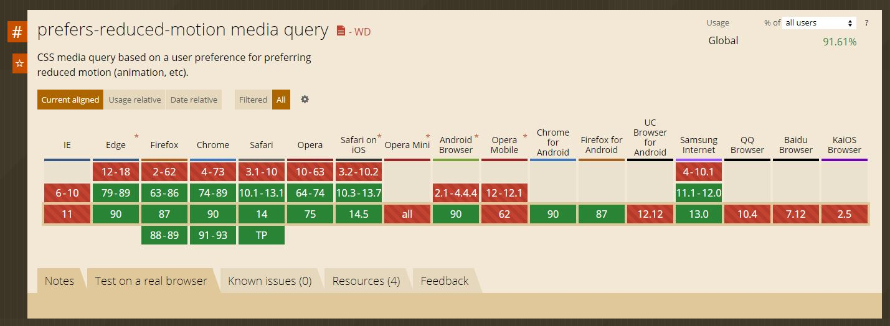

# 2.3 발작 예방(Seizures and Physical Reactions)

콘텐츠는 발작 또는 신체적 반응을 일으키지 않도록 설계되어야 합니다.

## 2.3.1 번쩍임을 3회 또는 임계값 이하로 설정 [A]

웹 페이지는 1초 동안 3번 이상 깜박이는 콘텐츠를 포함해서는 안됩니다. 또한 번쩍임(Flash)는 일반 플래시 및 레드 플래시 임계 값 이하로 설정해야 합니다.

> 이 성공기준을 충족하지 않는 콘텐츠는 전체 페이지 사용 능력에 방해가 될 수 있으므로 웹 페이지의 모든 콘텐츠(다른 기준을 충족하는 지 여부와 상관 없이)는 이 성공기준을 충족해야 합니다.

### 대상

- 발작 장애, 광과민성 발작을 가진 사람(광과민성 발작은 오랜 시간 불규칙적으로 깜박거리는 것에 자극받아 생기는 간질 발작으로 `닌텐도 증후군`이라고도 하는데 닌텐도 게임 중에 발작을 일으킨 경우가 많아 붙여진 이름이다)

### 예시

- 웹 사이트에 기관총이 발사되면서 총구가 번쩍이는 영상이 있는데, 번쩍거리는 이미지의 크기를 플래시 임계값 크기 이하로 작게 제한합니다.

## 2.3.2 1초에 3회 이상 깜빡임 [AAA]

웹 페이지는 1초 동안 3번 이상 깜박이는 콘텐츠를 포함해서는 안됩니다.

### 대상

- 발작 장애, 광과민성 발작을 가진 사람

### 예시

- 번개가 포함된 영상을 1초 동안 세 번만 깜박이도록 편집합니다.

## 2.3.3 상호작용 애니메이션 [AAA]

기능 조작이나 정보 전달에 애니메이션이 반드시 필요하지 않을 경우, 인터랙션에 의해 실행되는 모션 애니메이션을 사용자가 비활성화 할 수 있어야 합니다. 이 성공 기준을 준수하면 사용자가 애니메이션 비활성화 설정을 했을 경우, 불필요한 애니메이션을 동작하지 않도록 처리할 수 있습니다.

### 대상

- 인지 장애를 가진 사람
- 전정 장애(평형 감각 이상)가 있는 사람 (복잡하거나, 현란하게 움직이는 애니메이션에 현기증, 메스꺼움, 두통 등을 일으킬 수 있습니다)

### 예시

- 다양한 스크롤 애니메이션 인터렉션이 적용된 사이트
  
  
  

- 애플 사이트에서 `prefers-reduced-motion` 을 설정하여 배경 영상 재생과 확대 효과가 해제되는 예시입니다.  
  [모션을 위한 반응형 디자인 - example 1. 애플](https://webkit.org/blog/7551/responsive-design-for-motion/#using-reduce-motion-on-the-web)
  [애니메이션 동작 줄이기 미디어쿼리 사용 예시](https://webkit.org/blog-files/prefers-reduced-motion/prm.htm)
  [애니메이션 동작 줄이기 미디어쿼리 사용법 - nuli](https://nuli.navercorp.com/community/article/1132982)

- CSS 미디어에서 `prefers-reduced-motion` 에 속성을 추가하여 사용자가 동작 줄이기 모드를 설정했을 때 보여줄 애니메이션이나 전환효과를 변경할 수 있습니다.

  ```css
  @media (prefers-reduced-motion) {
    /* adjust motion of 'transition' or 'animation' properties */
  }
  ```

  

## 참고 자료

- [WCAG 2.1 Guidelines Explained with Examples](https://www.c2experience.com/blog/wcag-21-guidelines-explained-with-examples)
- [a11y WCAG 2.1 gitbook](https://a11y.gitbook.io/wcag/2-operable/2.1-keyboard-accessible)
- [Understanding Success Criterion 2.3.1](https://www.w3.org/WAI/WCAG21/Understanding/three-flashes-or-below-threshold.html)
- [Understanding Success Criterion 2.3.2](https://www.w3.org/WAI/WCAG21/Understanding/three-flashes.html)
- [Understanding Success Criterion 2.3.3](https://www.w3.org/WAI/WCAG21/Understanding/animation-from-interactions.html)
- [WCAG 2.1 새로운 성공 기준 소개 - naradesign](https://naradesign.github.io/wcag-2.1.html)
