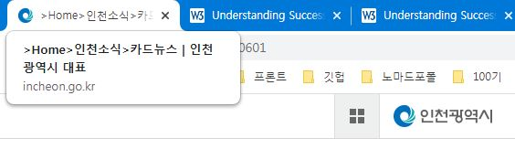
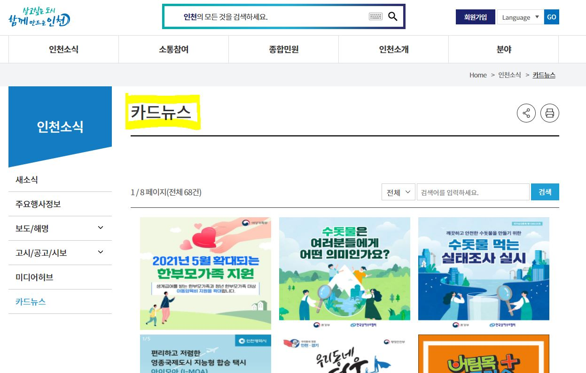
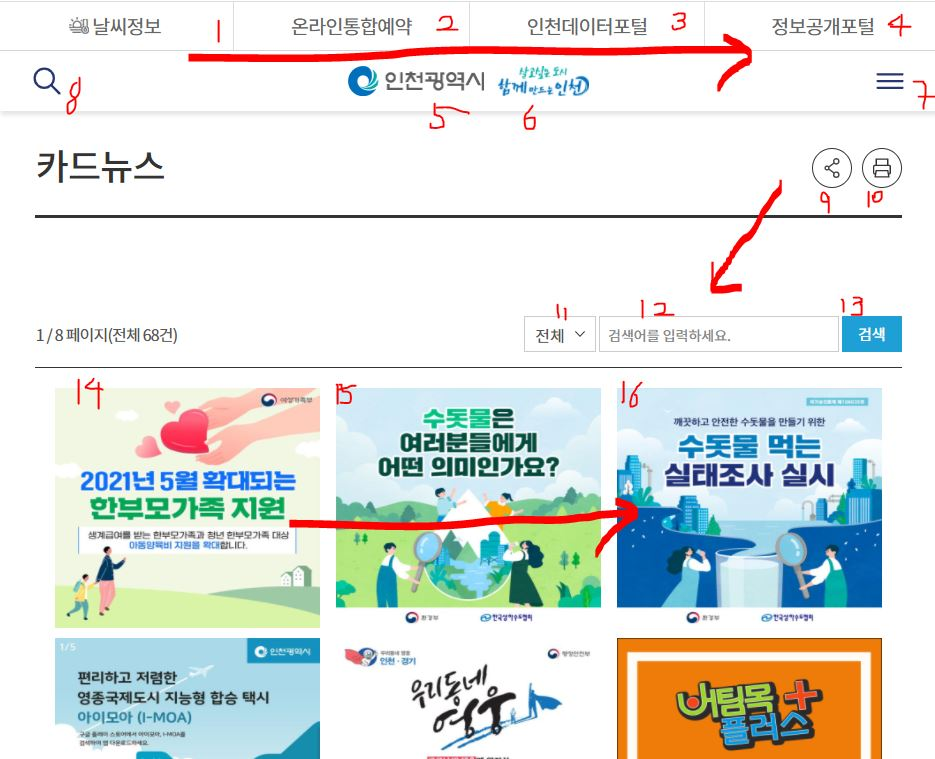
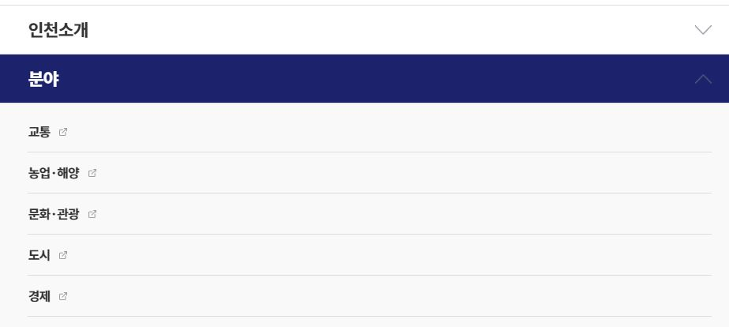
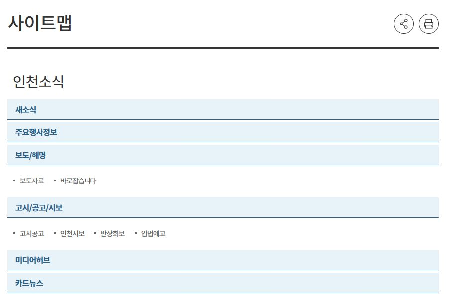
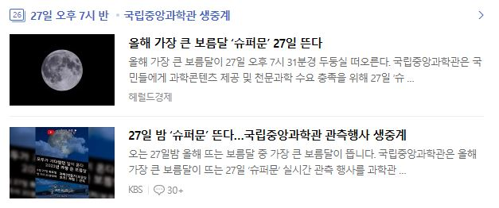
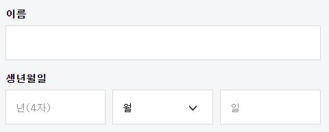
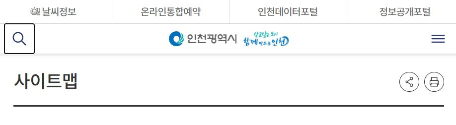
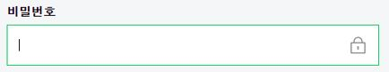

# 2.4 탐색 가능(Navigable)

탐색하고, 콘텐츠를 찾고, 현재 위치를 파악할 수 있는 방법을 제공해야 합니다.

## 2.4.1 블록 건너뛰기 [A]

여러 웹 페이지에서 반복되는 콘텐츠 블록을 건너 뛸 수 있는 기능을 제공해야 합니다.

### 대상

- 키보드 또는 키보드만을 사용하는 사람 (더 적은 키 입력으로 콘텐츠에 도달할 수 있습니다)
- 음성 입력을 사용하는 사람

### 예시

- 메뉴 건너 뛰기 링크는 웹 사이트에서 모든 페이지에 걸쳐 반복해서 등장하는 글로벌 내비게이션과 로컬 내비게이션을 건너 뛸 수 있는 링크를 말합니다. 웹접근성 연구소 페이지에서는 첫 화면에서 탭을 누르면 '본문 바로가기', '주메뉴 바로가기' 버튼을 확인할 수 있습니다.  
  
  [웹접근성 연구소](https://www.wah.or.kr:444/)

## 2.4.2 페이지 제목 [A]

웹 페이지는 주제나 목적을 설명하는 적절한 제목이 제공되어야 합니다.

### 대상

- 모든 사용자
- 저시력, 시각장애를 가진 사람(여러 사이트가 열려있을 때 제목으로 콘텐츠를 구분할 수 있습니다)

### 예시

- 인천광역시 웹사이트에서는 각 페이지마다 해당하는 제목을 제공하고 있습니다. 또한 `<title>` 요소 마크업을 이용해 브라우저의 탭에 제목이 표시됩니다.

  ```html
  <title>&gt;Home&gt;인천소식&gt;카드뉴스 | 인천광역시 대표</title>
  ```

  
  

## 2.4.3 포커스 순서 [A]

웹 페이지를 순차적으로 탐색 할 수 있고 탐색 순서가 의미 또는 작동에 영향을 주는 경우, 포커스할 수 있는 컴포넌트는 의미와 작동 가능성을 유지하는 순서로 포커스를 받아야 합니다.

### 대상

- 키보드를 사용하는 사람
- 저시력, 시각장애를 가진 사람

### 예시

- 인천광역시 웹사이트에서 `tab`키를 이용하여 의미와 작동가능성을 유지하는 순서로 포커스를 이동할 수 있습니다.  
  

## 2.4.4 링크 목적(맥락에서) [A]

각 링크의 목적은 링크 텍스트 만으로 식별 가능하거나 프로그래밍 방식으로 결정된 링크 맥락과 함께 식별 가능해야 합니다. (링크의 목적이 전반적으로 사용자에게 모호한 경우 제외)

### 대상

- 인지 장애 또는 시각 장애를 가진 사람

### 예시

- 인천광역시 웹사이트의 내비게이션 링크는 텍스트만으로 식별 가능합니다.  
  
- 뉴스 기사에서 각 글의 처음 몇 문장과 "더 보기" 링크가 표시되어 링크의 맥락이 함께 제공됩니다.

## 2.4.5 다양한 방법 [AA]

웹 페이지가 프로세스의 결과 또는 단계인 경우를 제외하고 웹 페이지 전체 내에서 특정 웹 페이지를 찾을 수 있는 방법을 여러 가지 방법으로 제공해야 합니다.

### 대상

- 화면돋보기나 스크린 리더를 사용하는 사람
- 인지 장애를 가진 사람 (사이트의 개요를 제공하는 목차나 사이트맵을 사용하는 것을 선호할 수 있습니다)

### 예시

- 인천광역시 웹사이트에서는 내비게이션과 별도로 사이트맵을 제공하고 있습니다.  
  

## 2.4.6 제목과 레이블 [AA]

제목(headings), 레이블은 적절한 주제 및 목적을 설명해야 합니다.

### 대상

- 기억력이 좋지 않은 사람
- 저시력, 시각장애를 가진 사람

### 예시

- 뉴스 페이지에는 주요 기사들의 헤드라인이 나열되어 있습니다. 각 제목은 기사의 주제를 명확하게 보여주며 전체 기사로 연결되는 링크를 제공합니다.  
  

- 회원가입시 사용자 이름과 생년월일을 입력하는 칸입니다. 입력칸에 따라 이름, 생년월일이라는 레이블을 제공하고 있습니다.  
  

## 2.4.7 식별 가능한 포커스 [AA]

키보드로 조작할 수 있는 사용자 인터페이스는 키보드 포커스 상태가 화면에 표시되어야 합니다.

### 대상

- 키보드를 사용하는 사람
- 주의력, 기억력에 한계를 가진 사람

### 예시

- 인천광역시 웹사이트에서 검색 아이콘 버튼에 포커스한 상태입니다. 아웃라인을 통해 현재 포커스한 위치를 알 수 있습니다.  
  

- 텍스트 입력창에 포커스가 위치하면 사용자가 텍스트를 입력할 수 있음을 나타내는 커서와 테두리가 표시됩니다.  
  

## 2.4.8 위치 [AAA]

일련의 웹 페이지에서 사용자 위치에 대한 정보를 제공해야 합니다.

### 대상

- 웹 페이지에서 긴 일련의 탐색 단계를 따를 때 혼동될 수 있는 주의 시간이 짧은 사람

### 예시

- 인천광역시 웹사이트에서 코로나19 - 예방접종 - 접종현황 메뉴를 클릭했을 때 보이는 화면입니다. 사용자가 현재 있는 위치를 확인할 수 있습니다.  
  

## 2.4.9 링크 목적(링크만) [AAA]

링크의 목적이 전반적으로 사용자에게 모호한 경우를 제외하고, 링크 텍스트만으로 각 링크의 목적을 식별 할 수 있는 방법을 제공해야 합니다. 사용자가 각 링크의 목적을 이해하고 해당 링크로 이동할지 여부를 결정할 수 있게
도와줍니다.

### 대상

- 인지 장애를 가진 사람 (관심없는 콘텐츠를 추가로 탐색하다가 혼란을 겪을 수 있습니다)
- 시각 장애 및 운동 장애를 가진 사람

### 예시

- 책을 HTML, PDF, mp3(오디오북)의 세가지 형식으로 제공하는 웹사이트의 경우, 책 제목뒤에 각 형식으로 연결되는 링크가 표시됩니다. 링크별로 렌더링된 텍스트는 책의 형식만 나타내지만, 각 링크와 연결된 텍스트에는 형식뿐 아니라 제목도 포함하여 "걸리버 여행기, MP3"와 같은 형태로 제공합니다.
- HTML `<a>`요소의 텍스트로 연결된 링크의 목적을 설명합니다.
  ```html
  <a href="routes.html"> Current routes at Boulders Climbing Gym </a>
  ```
- 이미지를 링크로 사용하는 경우 `alt`속성에 링크의 목적을 명시합니다.

  ```html
  <a href="routes.html">
    
  </a>
  ```

## 2.4.10 섹션 제목 [AAA]

섹션 제목을 이용해 콘텐츠를 구성합니다. '제목(Heading)'은 보편적인 의미로 사용된 용어이며, 제목뿐 아니라 다양한 종류의 콘텐츠에 제목(title)을 넣는 방법들을 포함합니다.

### 대상

- 학습장애가 있는 사람
- 시각장애가 있는 사람
- 키보드로 콘텐츠를 탐색하는 사람

### 예시

- 웹 애플리케이션의 설정 페이지에서 관련 설정끼리 묶어 몇 개의 그룹으로 제공합니다. 각 그룹에는 설정 등급을 설명하는 제목이 표시됩니다.

## 참고 자료

- [WCAG 2.1 Guidelines Explained with Examples](https://www.c2experience.com/blog/wcag-21-guidelines-explained-with-examples)
- [a11y WCAG 2.1 gitbook](https://a11y.gitbook.io/wcag/2-operable/2.5-input-modalities)
- [knowbility blog - Exploring WCAG 2.1](https://knowbility.org/blog/2018/WCAG21-255TargetSize)
- [Understanding Success Criterion 2.4.1](https://www.w3.org/WAI/WCAG21/Understanding/bypass-blocks.html)
- [Understanding Success Criterion 2.4.2](https://www.w3.org/WAI/WCAG21/Understanding/page-titled.html)
- [Understanding Success Criterion 2.4.3](https://www.w3.org/WAI/WCAG21/Understanding/focus-order.html)
- [Understanding Success Criterion 2.4.4](https://www.w3.org/WAI/WCAG21/Understanding/link-purpose-in-context.html)
- [Understanding Success Criterion 2.4.5](https://www.w3.org/WAI/WCAG21/Understanding/multiple-ways.html)
- [Understanding Success Criterion 2.4.6](https://www.w3.org/WAI/WCAG21/Understanding/headings-and-labels.html)
- [Understanding Success Criterion 2.4.7](https://www.w3.org/WAI/WCAG21/Understanding/focus-visible.html)
- [Understanding Success Criterion 2.4.8](https://www.w3.org/WAI/WCAG21/Understanding/location.html)
- [Understanding Success Criterion 2.4.9](https://www.w3.org/WAI/WCAG21/Understanding/link-purpose-link-only.html)
- [Understanding Success Criterion 2.4.10](https://www.w3.org/WAI/WCAG21/Understanding/section-headings)
