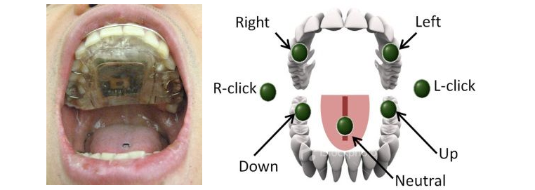
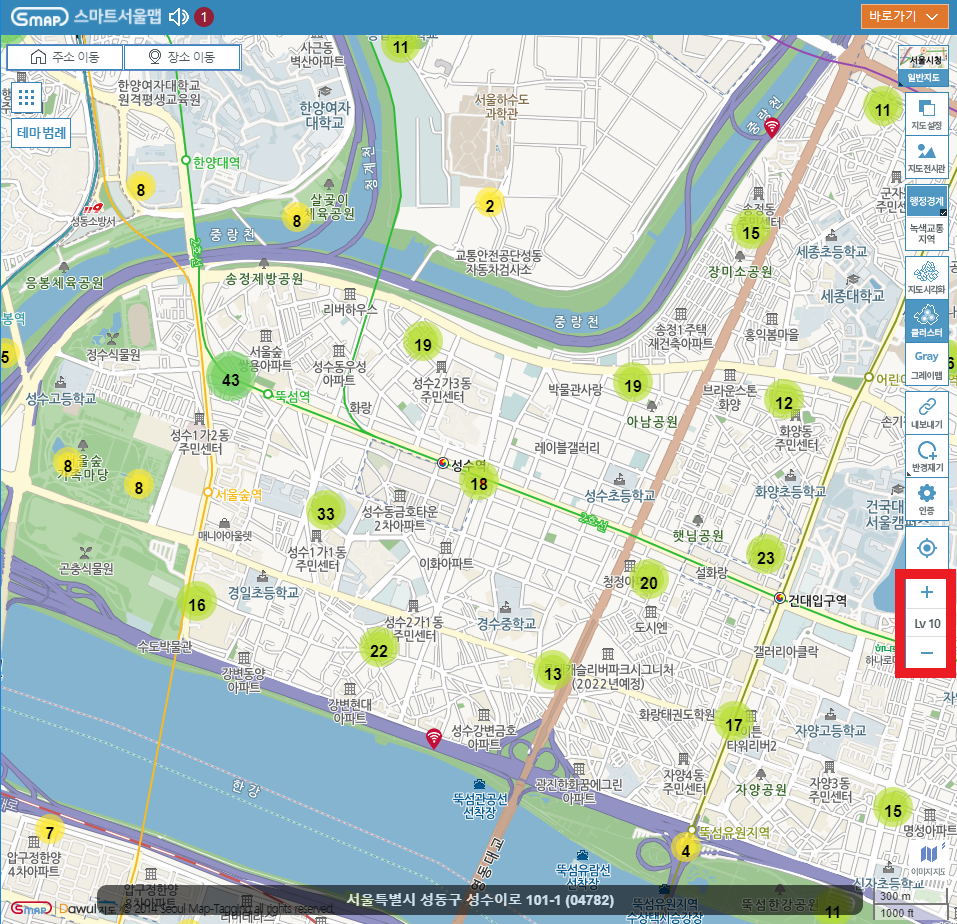
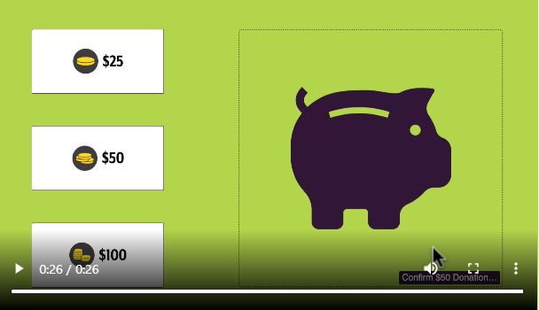
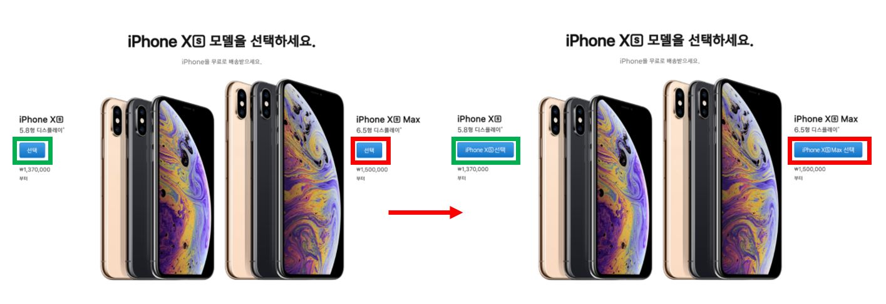
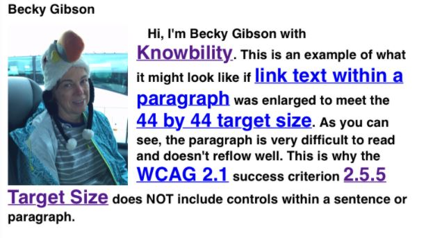
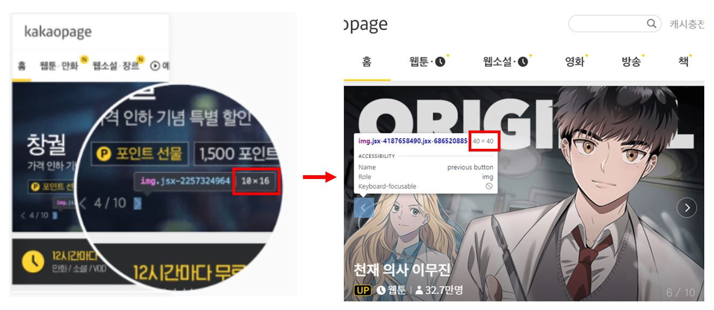

# 2.5 입력 양식(Input Modalities)

키보드가 아닌 다양한 입력을 통해 사용자가 기능을 보다 쉽게 조작 할 수 있도록 만들어야 합니다.

## 2.5.1 포인터 제스처 [A]

멀티 포인트 또는 패스 기반 제스처(gesture)를 사용하는 모든 기능은 멀티 포인트 또는 패스 기반 제스처가 필수적인 경우가 아니면 패스 기반 제스처 없이 싱글 포인터로 작동 할 수 있어야 합니다. 이 지침은 필수적인 경우를 제외하고는 단 한 번의 터치 만으로 모든 기능을 사용할 수 있어야 함을 명시합니다. 즉, 확대/축소 및 스위핑과 같은 다중 포인터 또는 경로 기반 제스처를 제공할 경우 탭, 더블 탭 및 길게 누르는 것과 같은 단일 포인터로도 기능을 사용할 수 있어야 합니다.


> 이 가이드라인은 포인터 작업을 해석하는 웹 콘텐츠에 적용됩니다. 사용자 에이전트(예: 브라우저)의 기본 제스처 또는 보조 기술을 작동하는데 필요한 작업에는 적용되지 않습니다)

### 대상

- 손 떨림이나 움직임이 제한적인 사람 (두 손가락이나 복잡한 움직임이 필요한 제스처를 정확하게 조작하기 어렵습니다)
- 마우스 스틱, 헤드 포인터, 시선추적 시스템, 음성제어 마우스와 같은 대체 입력 장치를 사용하는 사람  
  [](https://www.youtube.com/embed/4mp6dtp1mJ8)  
  [](https://www.youtube.com/embed/J4cj6r2QrHM)
- 인지 기능 장애가 있는 사람 (기억하고 사용하기 쉬운 간단한 제스처는 도움이 됩니다)
- 치아에 박힌 작은 자석을 추적하는 치과 센서장치를 통해 수신한 신호를 명령어로 만들어 휠체어에 전달하는 입 천장의 혀 작동 시스템(Tongue Drive System)을 이용하는 사람  
  

### 예시

- [myalbum.com](https://myalbum.com/album/cc0cRaWhajJ2) 사이트에서 제공하는 사진앨범에서 사용자는 스위핑과 버튼, 키보드 화살표 키를 이용해 다음 사진으로 이동할 수 있습니다.
  

- [스마트 서울맵](https://map.seoul.go.kr/smgis2/smap/XkJBU0VNQVBfR0VOXlQ6MTFeRl5GXkZeXl5eXl4xMjYuOTc4NTc2XjM3LjU2NjUwMl42XjExMTAyODEyXmNpdHlMaWZlXl5eLg==) 사이트에서 확대, 축소 모드 변경을 싱글포인트로도 제어할 수 있습니다. 키보드의 화살표 키를 사용하여 지도 이동 또한 가능합니다.
  

## 2.5.2 포인터 취소 [A]

싱글 포인터를 사용하여 작동할 수 있는 기능의 경우 다음 중 하나 이상이 충족 되어야 합니다.

- down 이벤트 비활성화(No Down-Event)
  포인터의 down 이벤트는 함수 일부를 실행하는데 사용하지 않습니다.

- 중단(Abort) 또는 실행 취소(Undo)
  함수의 완료는 up 이벤트에 있고 완료 전에 함수를 중단하거나, 완료 후 함수를 실행 취소하는 방법을 제공합니다.

- up 이벤트를 통한 취소(Reversal)
  up 이벤트는 이전 down 이벤트의 결과를 뒤집을 수 있습니다.

- down 이벤트를 필수적으로 작동해야 하는 경우는 예외
  피아노나 드럼연주 시뮬레이션, 두더지 게임 애플리케이션의 경우 down 이벤트를 통해 즉시 실행되어야 합니다.

### 대상

- 실수로 잘못된 위치를 만지거나 클릭 할 수 있는 손 떨림, 운동 장애가 있는 사람
- 인지 장애가 있는 사람(우연히 컨트롤을 활성화 했기 때문에 예기치 않은 일이 발생하면 혼란스러울 수 있습니다)
- 일반 사용자(실행 취소 기능은 일반 사용자에게도 도움이 됩니다)

### 예시

- 아래 영상은 기부금액을 선택하여 돼지저금통으로 Drag & Drop 하여 기부하거나 취소할 수 있는 예시를 보여줍니다.

  - 기부 금액이 표시된 버튼을 클릭 후 Drag & Drop하여 기부합니다. 기부 상자 밖에서 포인터를 놓으면 기부를 취소합니다.
  - 기부상자에 포인터를 놓으면 오른쪽 하단에 컨펌 메세지가 표시됩니다. 클릭하면 기부가 완료됩니다.
  - 컨펌 메세지를 잘못 클릭했을 경우, 포인터를 움직여 버튼 밖에서 포인터를 놓으면 취소됩니다.
    [](https://assets.knowbility.org/2021/blog/WCAG21-252-example.mp4)

## 2.5.3 레이블과 접근 가능한 이름 [A]

음성입력 사용자가 활성화할 컴포넌트를 식별할 수 있도록 컴포넌트에 접근 가능한 이름이 있어야 합니다. 접근 가능한 이름이 레이블 이름과 일치하지 않거나, 레이블 이름으로 시작하지 않을 경우 사용자는 혼란에 빠질 수 있습니다.

- `접근 가능한 이름`은 보조 기술 사용자가 컨트롤을 식별하는데 사용되는 이름입니다. 즉, 보조기술(예: 스크린리더) 사용자에게 들리는 텍스트나 음성입력 사용자가 말하는 텍스트가 해당됩니다.
- HTML 입력 요소의 name 속성과는 관련이 없습니다.
- `alt`, `aria-label`, `aria-labelledby` 속성을 이용해 설정합니다.

### 대상

- 음성 입력(Speech-input)을 사용하는 사람
- 텍스트 음성 변환(Text-to-speech)을 사용하는 사람 (들리는 라벨이 화면에 보이는 텍스트 라벨과 일치하기 때문에 더 나은 경험을 할 수 있습니다)

### 예시

- 제품을 선택하는 버튼 레이블이 "선택"으로만 주어질 경우, 음성 입력 사용자는 화면을 보고 "선택" 이라고 말하지만, 음성 소프트웨어는 해당 레이블을 접근 가능한 이름으로 인식하지 못합니다. 음성 소프트웨어가 식별 가능한 접근가능한 이름은 "iPhone Xs 선택" 입니다. 이 문제를 해결하려면 화면에 표시되는 레이블과 접근 가능한 이름을 동일하게 만들어야 합니다. 이를 수행할 수 없는 경우라면 접근 가능한 이름을 화면에 버튼과 함께 표시하여 사용자가 접근 가능한 이름을 올바르게 유추할 수 있도록 해야 합니다.
  

## 2.5.4 동작(모션) 실행 [A]

장치를 움직이거나(예: 흔들림 또는 기울임) 장치를 향한 제스처에 의해 활성화되는 기능(카메라 같은 센서가 제스처를 포착하고 해석)은 일반적인 UI 구성 요소에 의해서도 작동할 수 있어야 합니다.

- 동작(모션) 실행 기능에 대한 대체 인터페이스를 제공해야 합니다. 동작을 실행하기 위해 요구되는 모션의 예는 다음과 같습니다.

  - 모바일 장치를 흔들어 마지막 동작을 실행 취소합니다.
    
  - 장치를 오른쪽으로 기울이면 전진하고, 왼쪽으로 이동하면 일련의 단계가 진행됩니다.
    
  - 시퀀스를 통해 앞으로 또는 뒤로 이동하기 위해 사용자를 바라보는 카메라를 향해 몸짓 합니다.
    

- 사용자가 동작(모션) 실행 기능을 해제할 수 있어야 합니다.

- 접근성 지원 인터페이스 제외
  접근성 지원 인터페이스는 동작에 의존하는 보조 기술을 말합니다. 카메라를 사용해 시선의 움직임을 감지하여 커서를 움직이는 시선 추적 소프트웨어가 대표적인 예입니다.

- 필수 상황 예외
  모션 기능이 필수적인 경우는 예외로 합니다.
  마라카스로 연주하기 위해서 스마트폰을 흔드는 것은 장치의 동작(모션)이 필수입니다.
  

### 대상

- 장치를 고정된 위치에 장착시킨채 이동할 수 없는 사람(휠체어 타고 있는 경우)
- 손 떨림이 있는 사람(실수로 장치를 움직여 의도치 않은 동작이 작동될 수 있습니다)
- 자동차나 버스에 타 있어 동작을 할 수 없는 불안정한 환경에 있는 사람
- 동작(기울기, 흔들기 또는 제스처 등)을 수행할 수 없는 사람

### 예시

- Shake 'em Dice 앱은 장치를 흔들면 주사위가 굴러가는 기능을 제공합니다. 2.5.4 기준을 만족하려면 탭을 했을 때도 주사위가 굴러가도록 구현해야 합니다.
  
- 텍스트 입력 후, 장치를 흔들어 입력을 취소(shake to undo)하는 기능을 제공한다면 사용자가 동일한 기능을 버튼으로도 사용할 수 있도록 텍스트 상자 옆에 취소버튼을 제공해야 합니다.
- 어플리케이션에서 장치를 기울여 다음 페이지 또는 이전 페이지로 이동할 수 있는 기능을 제공하는 경우, 동일한 기능을 수행할 수 있는 버튼도 제공해야 합니다.

## 2.5.5 실행 영역 [AAA]

포인터 또는 터치에 의한 실행 영역은 다음 경우를 제외하고는 44×44 CSS 픽셀 이상이어야 합니다.

- 동등한 기능 존재(equivalent)
  동일한 페이지에서 실행 영역이 44×44 CSS 픽셀 이상인 동일한 링크 또는 컨트롤이 존재하는 경우는 예외입니다.
  

- 인라인(inline)
  실행 영역이 문장 또는 문장 블록인 경우, 한 문장 내에서 링크 글자만 크게 만들 수 없으므로 예외입니다.
  

- 사용자 에이전트 컨트롤(user agent controll)
  실행 영역이 개발자가 작성한 마크업이 아닌, 사용자 에이전트(예: 브라우저)에 의해 결정되는 경우는 예외입니다. `<button>, <select>, <input type="radio">` 요소와 같은 표준 HTML 컨트롤 중 개발자가 임의로 스타일을 조정하지 않은 경우를 말합니다. 아래는 브라우저에서 기본으로 제공되는 비디오 플레이어 컨트롤 모습입니다.
  

- 필수 상황(essential)
  실행 영역을 시각적으로 표시하는 것이 정보 전달에 필수적인 경우에는 예외입니다.

### 대상

- 실행영역을 정확하게 클릭하기 힘든 사람
- 손 떨림이나 운동 장애가 있는 사람
- 마우스 스틱과 같은 대체 포인터를 사용하는 사람
- 터치 스크린이 주요 모드인 모바일 기기를 사용하는 사람

### 예시

- 카카오 페이지 웹사이트의 캐러셀 인터페이스입니다. 내비게이션 컨트롤을 사용해 캐러셀 아이템을 탐색할 수 있습니다. 왼쪽은 컨트롤 크기가 10×16 CSS 픽셀로 2.5.5 기준을 한참 만족하지 못하고 오른쪽은 최근 페이지의 컨트롤 버튼으로 40x40 CSS 픽셀로 크기가 개선된 모습을 볼 수 있습니다.
  

- 모바일 사용자의 경우 버튼이 너무 작거나 촘촘하게 배치되어 있으면 누르고자 하는 버튼 외에 다른 버튼이 눌려져 어려움을 겪습니다. 44×44 CSS 픽셀 크기는 일반적으로 모바일 장치의 9mm 크기에 해당합니다. 이 크기는 대부분의 사람들이 손가락이나 다른 포인팅 장치를 사용하여 보고 터치할 수 있을 만큼 충분히 크며, Apple iOS UI 가이드라인에서도 제시되는 기준입니다.  
  

## 2.5.6 동시 입력 메커니즘 [AAA]

웹 콘텐츠는 제한이 필수적인 경우(콘텐츠 보안 보장, 사용자 설정을 침해하면 안되는 경우)를 제외하고 플랫폼에서 사용할 수 있는 입력 방식을 제한해서는 안 됩니다. 사용자가 터치 또는 마우스만 사용한다고 가정하여 개발 해서는 안되며 사용자가 입력하는 다양한 방식을 고려해야 합니다.

- 사용자가 선호하는 입력 장치를 사용하여 웹콘텐츠에 접근할 수 있도록 해야 합니다.
- 콘텐츠 작업 중 다른 입력장치로의 전환이 가능해야 합니다. 음성 입력을 사용하거나 키보드를 연결해서 사용할 수 있어야 합니다.

### 대상

- 여러 개의 기기를 사용하면서 화면전환, 키보드, 터치스크린 등 다양한 입력을 사용하는 사람

### 예시

- 음성 입력 사용자는 개인 정보 보호를 위해 암호를 입력할 때 키보드로 전환하는 것을 선호 할 수 있습니다.
- 아래와 같이 같은 작동을 하는 키보드, 마우스 이벤트를 등록하지 않는다면 터치로만 작동하는 이벤트를 사용하는 것은 지양해야 합니다.

  ```javascript
  document.addEventListener(‘touchstart’, function () {
    // avoid using touch-only events
    // unless simultaneous keyboard/mouse events are registered
  });
  ```

## 참고 자료

- [WCAG 2.1 Guidelines Explained with Examples](https://www.c2experience.com/blog/wcag-21-guidelines-explained-with-examples)
- [a11y WCAG 2.1 gitbook](https://a11y.gitbook.io/wcag/2-operable/2.5-input-modalities)
- [knowbility blog - Exploring WCAG 2.1](https://knowbility.org/blog/2018/WCAG21-255TargetSize)
- [Understanding Success Criterion 2.5.1](https://www.w3.org/WAI/WCAG21/Understanding/pointer-gestures.html)
- [Understanding Success Criterion 2.5.2](https://www.w3.org/WAI/WCAG21/Understanding/pointer-cancellation)
- [Understanding Success Criterion 2.5.3](https://www.w3.org/WAI/WCAG21/Understanding/label-in-name.html)
- [Understanding Success Criterion 2.5.4](https://www.w3.org/WAI/WCAG21/Understanding/motion-actuation.html)
- [Understanding Success Criterion 2.5.5](https://www.w3.org/WAI/WCAG21/Understanding/target-size.html)
- [Understanding Success Criterion 2.5.6](https://www.w3.org/WAI/WCAG21/Understanding/concurrent-input-mechanisms.html)
