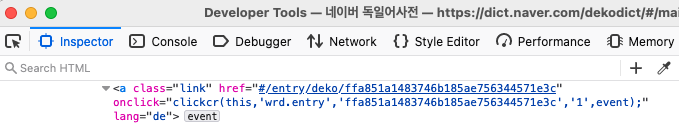
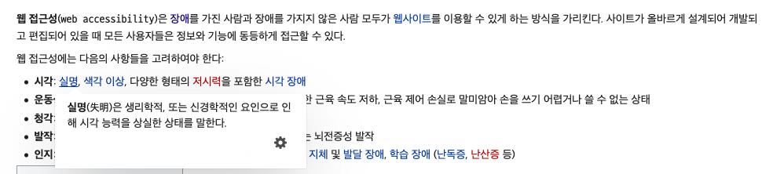
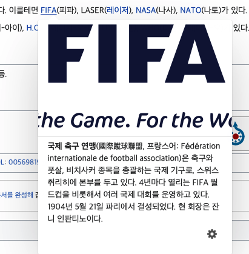
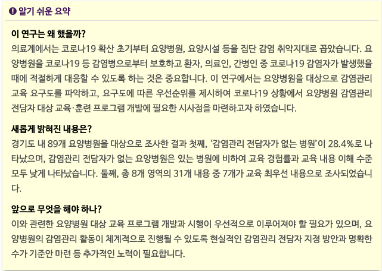
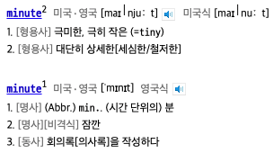

# 3.1 가독성 (Readable)
가독성이란 "**텍스트 내용을 읽고 이해하기 쉽게 작성해야 한다**"는 지침입니다.

## 3.1.1 기본 언어 설정 [A]
각 웹 페이지의 기본 언어는 프로그래밍 방식으로 결정할 수 있습니다.
- 기본 언어 설정이 누락될 경우
    - 기본 텍스트 처리 언어는 가장 많이 사용되는 언어 
    - 여러 언어가 동일할 경우 첫 번째 언어
- 취지는 사용자 에이전트가 언어 콘텐츠를 올바르게 표시하는데 필요한 정보를 제공하는 것입니다.
    - 웹 페이지의 언어가 식별될 때 보다 정확하게 렌더링이 가능합니다.
    - 스크린 리더는 올바른 발음 규칙을 로드할 수 있습니다.
- 결과적으로, 장애가 있는 사용자들은 웹 페이지의 내용을 더 잘 이해할 수 있습니다. 

### 대상
- 텍스트를 음성 합성으로 변화하는 기술 또는 스크린 리더 사용자
- 동기화된 미디어에 대한 캡션을 사용하는 사용자

### 예시
- 네이버의 경우 한국어와 영어로 된 내용이 모두 포함되어 있지만 기본 언어는 한국어(ko) 입니다. 
   

## 3.1.2 보조 언어 설정 [A]
콘텐츠에서 각 문단이나 문구는 프로그래밍 방식으로 결정될 수 있어야 합니다.
- 고유 이름, 전문 용어, 불확실한 단어, 주변 텍스트의 일부분이 된 단어나 문장은 제외합니다.
- 다른 언어가 지정되지 않은 경우 기본 언어로 설정됩니다.
- 취지는 여러 언어로 작성된 콘텐츠를 올바르게 표시할 수 있도록하는 것입니다.
  - 사용자 에이전트와 보조 기술이 해당 언어의 표현 및 발음 규칙에 따라 표현할 수 있습니다.

### 대상
- 텍스트를 음성 합성으로 변화하는 기술 또는 스크린 리더 사용자
- 동기화된 미디어에 대한 캡션을 사용하는 사용자

### 예시
- 네이버 독일어사전의 경우, 독일어를 표현하는 구문의 lang 속성은 "de"로 되어있다. 
   

## 3.1.2 보조 언어 설정 [A]
콘텐츠에서 각 문단이나 문구는 프로그래밍 방식으로 결정될 수 있어야 합니다.
- 고유 이름, 전문 용어, 불확실한 단어, 주변 텍스트의 일부분이 된 단어나 문장은 제외합니다.
- 다른 언어가 지정되지 않은 경우 기본 언어로 설정됩니다.
- 취지는 여러 언어로 작성된 콘텐츠를 올바르게 표시할 수 있도록하는 것입니다.
  - 사용자 에이전트와 보조 기술이 해당 언어의 표현 및 발음 규칙에 따라 표현할 수 있습니다.

### 대상
- 텍스트를 음성 합성으로 변화하는 기술 또는 스크린 리더 사용자
- 동기화된 미디어에 대한 캡션을 사용하는 사용자

### 예시
- 네이버 독일어사전의 경우, 독일어를 표현하는 구문의 lang 속성은 "de"로 되어있다. 
   

## 3.1.3 익숙하지 않은 단어들 [AAA]
관용어와 전문용어를 포함한 특수하거나 제한적으로 사용된 단어나 문장들의 특정 정의를 확인하는 기능을 제공해야 합니다.
- 취지는 장애를 가진 사람들과 비전문가도 이해할 수 있도록 정의를 제공하는 메커니즘을 제공하는 것입니다.

### 대상
- 단어를 해독하는게 어려운 사람
- 단어와 구절을 이해하기 어려운 사람

### 예시
- 위키피디아에서 용어를 검색하게 되면 전문용어와 같은 익숙하지 않은 단어들의 정의를 확인할 수 있는 기능을 제공합니다. 
   

## 3.1.4 약어
약어의 뜻이나 확장된 형식을 확인할 수 있는 기능을 제공해야 합니다.
- 취지는 사용자가 다양한 형태의 약어에 접근할 수 있도록 하기 위함입니다.

### 대상
- 단어를 해독하는 데 어려움이 있는 사람
- 화면 돋보기에 의존하는 사람
- 제한된 메모리를 사용하는 사람

### 예시
- 위키피이아에서 약어에 마우스를 올리면 설명을 확인할 수 있다. 
   

## 3.1.5 독해 수준 [AAA] 
중등교육 과정보다 높은 읽기 능력을 요구하는 복잡한 내용이 포함된 웹 페이지의 경우, 이를 보완하는 콘텐츠 또는 그러한 독해력이 필요하지 않은 버전을 제공해야 합니다.
- 취지는 내용은 가능한 한 명확하고 간단하게 작성하게 하는 것입니다.

### 대상
- 정보를 얻기 위한 목적으로 서먼 언어를 이해하고 해석하는데 어려움이 있는 사람

### 예시
- 한국보건사회연구원의 최신호를 보게되면 비전문가들도 이해할 수 있게 요약한 "알기 쉬운 요약"을 확인할 수 있다. 
   

## 3.1.6 발음 [AAA]
발음을 모르면 문맥에서 단어의 의미가 모호한 경우 단어의 구체적인 발음을 확인하는 메커니즘을 제공해야 합니다.
- 취지는 시작장애인과 시력이 낮은 사람, 독서장애인이 발음에 따라 단어의 의미가 달라지는 경우 콘텐츠를 이해할 수 있도록 돕는 것입니다.
  - 모호한 문장들, 또는 일부 언어의 경우, 단어의 발음을 모르면 잘못 해석하는 경우가 있다.
  - 화면 판독기는 발음에 대한 정보가 없다면 문자를 잘못 말할 수 있습니다.
    - 예를 들어, 일본의 한자는 같은 여러가지 발음을 가지는 문자가 있습니다.

### 대상
- 단어를 해독하는데 어려움이 있는 사람
- 단어를 소리내어 읽는 기술을 사용하는 사람

### 예시
- "minute"라는 단어는 발음에 따라 '극미한', '분'이라는 뜻이 있습니다. 네이버 사전의 경우 발음 기호를 제공합니다. 
   

## 참고 자료
- [네이버 사전](https://dict.naver.com)
- [위키피디아](https://ko.wikipedia.org/)
- [한국보건사회연구원](https://www.kihasa.re.kr/)
- [홍콩 사무국](https://www.ogcio.gov.hk/)
- [이듬 WCAG 2.1](https://a11y.gitbook.io/)
- [W3C WCAG 2.1](https://www.w3.org/TR/WCAG21/#status-messages)