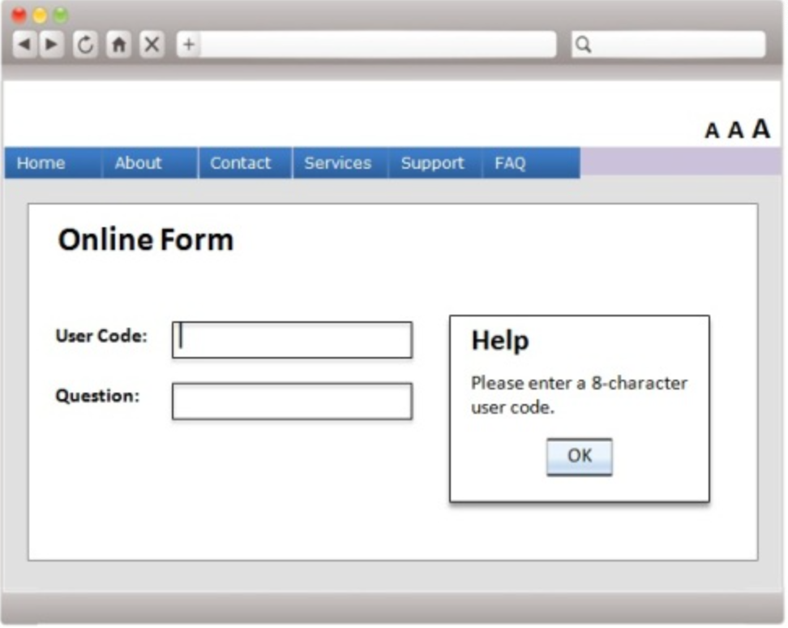
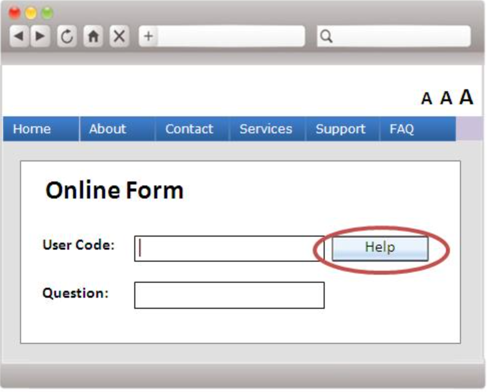
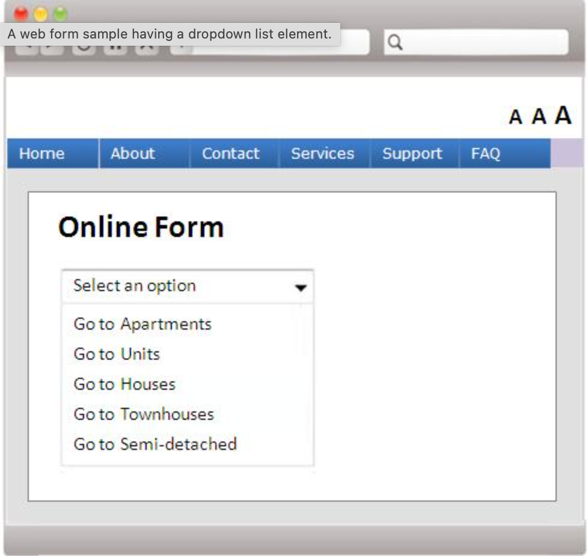
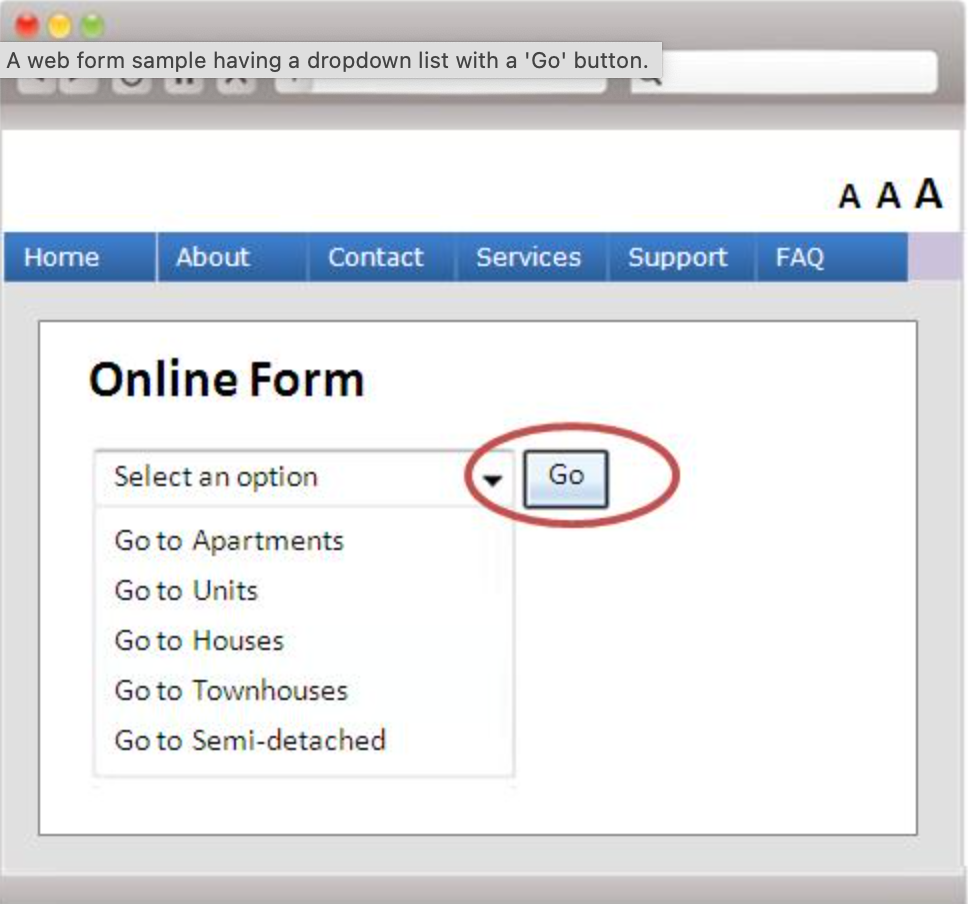
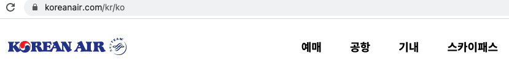
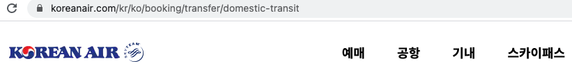
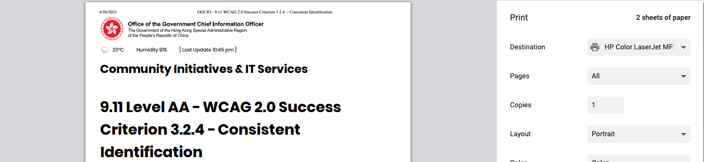
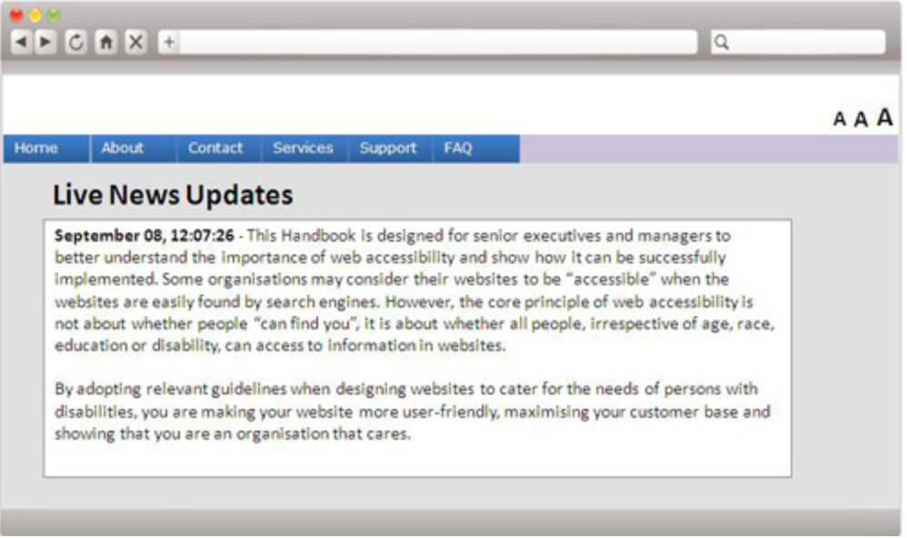
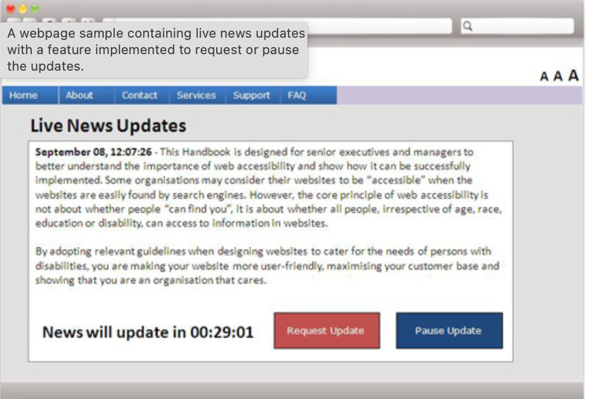

# 3.2 예측 가능성(Predictable)
웹 페이지는 예측 가능한 방식으로 나타나고 작동해야 합니다.

## 3.2.1 포커스 상태 [A]
UI 구성 요소가 포커스 상태가 되면, 맥락을 변경하지 않습니다.
- 취지는 방문자가 문서를 탐색할 때 기능을 예측할 수 있도록하는 것입니다.
    - 포커스를 받을 때 이벤트를 트리거할 수 있는 구성 요소는 맥락을 변경해서는 안됩니다.
    - 포커스는 키보드 또는 마우스를 통한 컨트롤로 이동할 수 있습니다.
- 구성 요소가 포커스를 받을 때 맥락을 변경하는 예는 다음과 같습니다.
    - 포커스를 받을 때 자동으로 제출되는 양식
    - 포커스를 받을 때 실행되는 새 창
    - 해당 구성 요소가 포커스를 받으면 포커스가 다른 구성 요소로 변경

### 대상
- 상황이 예기치 않게 변경 될 가능성을 줄여 시각 장애, 인지 제한 및 운동 장애가 있는 사람들을 돕습니다.

### 예시
- 구성 요소가 포커스를 받으면 도움말 대화 상자가 열렸지만, 포커스 상태 성공 기준을 적용하여 도움말을 읽도록 강요하지 않게 만들었습니다. 

## 3.2.2 입력 상태 [A]
어떠한 UI 구성 요소의 설정 변경도, 해당 구성 요소를 사용하기 전에 사용자에게 그 행동을 알리지 않는 한, 자동으로 맥락이 변경되어서는 안됩니다.
- 취지는 데이터를 입력하거나 양식 컨트롤을 선택하면 예측 가능한 효과가 있는지 확인하는 것입니다.
    - 맥락의 변화는 변화를 쉽게 인식하지 못하거나 쉽게 산만해지는 사용자에게 혼란을 줄 수 있습니다.

### 대상
- 장애가 있는 사용자에게 도움이 됩니다.
- 시각 장애, 읽기 및 지적 장애가 있는 사람 및 시각 신호를 해석하는데 어려움이 있는사람들은 맥락의 변화를 감지하기 위해 추가 단서의 도움을 받을 수 있습니다.

### 예시
- 라디오 버튼 세트가 있는 양식 화면에서 버튼 클릭 시 항목의 일부만 변경되고 전체구조가 동일하게 유지되기 떄문에 기본 컨텍스트가 사용자에게 남아있습니다.
- 드롭 다운 메뉴에서 맥락이 변경되면 양식이 자동으로 제출되었지만, 입력 상태 성공 기준 적용 후 사용자가 양식을 제출해야지만 변경되게 되었습니다. 
 
 

## 3.2.3 일관된 네비게이션 [AA]
웹 페이지 집합 내의 여러 웹 페이지에서 반복되는 네비게이션은 사용자가 변경하지 않는 한, 반복될 때마다 동일한 순서로 제시되어야 합니다.
- 취지는 웹 페이지 집합 내에서 반복되는 콘텐츠와 상호 작용하고 특정 정보나 기능을 두 번이상 찾아야하는 사용자에게 일관된 프레젠테이션 및 레이아웃을 사용하도록 자려하는 것입니다.
    - "동일한 순서"라는 문구를 사용한다고해서 하위 탐색 메뉴를 사용할 수 없다는 것은 아닙니다.
    - 반복되는 콘텐츠와 상호 작용하는 사용자가 찾고있는 콘텐츠의 위치를 예측하고 다시 찾을 때 더 빨리 찾을 수 있도록 지원하기 위한 것입니다.
    - 적응형 사용자 에이전트를 사용하거나 정보가 가장 유용한 방식으로 제공되도록 기본 설정 순서 변경을 할 수 있습니다.

### 대상
- 각 페이지에서 항목을 찾을 수 있는 위치를 예측할 수 있다는 확신을 갖게되어, 시력이 낮거나 장님인 사용자들과 인지 및 지적 장애가 있는 사람들에게 도움이 됩니다.

### 예시
- 대한항공 웹 페이지에서 상단의 네비게이션은 다른 페이지로 이동해도 변경되지 않습니다. 
 
 

## 3.2.4 일관된 식별 [AA]
웹 페이지 집합 내에서 동일한 기능을 가진 구성 요소는 일관되게 구별되어야 됩니다.
-  취지는 웹 페이지 집합 내에서 반복적으로 나타나는 기능 구송 요소를 일관되게 식별하는 것입니다.
    - 동일한 기능이 다른 웹페이지에서 다른 레이블(또는 액세스 가능한 이름)을 갖는 경우 사이트를 사용하기가 훨씬 더 어려워집니다.
    - 일관된 라벨링이 도움이 됩니다.
    - 아이콘 또는 기타 텍스트가 아닌 항목의 기능이 동일한 경우 대체 텍스트도 일관성이 있어야 합니다
    - 항상 단일 웹 페이지 내에서 일관성을 유지하는 것이 바람직하고 모범 사례입니다.
        - 단, 3.2.4는 집합의 두 페이지 이상에서 무언가가 반복되는 일관성만 해결합니다.

### 대상
- 사이트의 한 페이지에서 기능을 사용하는 사람들은 다른 페이지에서 원하는 기능을 찾을수있습니다.
- 대체 텍스트에 의존하는 사람들은 기존보다 더 예측 가능한 경험을 할 수 있습니다.
    - 또한 다른 페이지에 일관된 레이블이 있는 구성 요소를 검색 할 수도 있습니다.

### 예시
- 홍콩 정부 CIO 사무국 웹 페이지 어디에서든 프린트 이미지를 클릭하면 해당 페이지를 출력할 수 있다. 
 
 

## 3.2.5 요구에 의한 변경 [AAA]
맥락의 변경은 사용자 요청에 의해서만 일어나야 하며, 그러한 변경을 해제할 수 있는 기능을 제공해야 합니다.
- 취지는 사용자에게 맥락의 변경을 완전히 제어할 수 있는 웹 콘텐츠 디자인을 장려하는 것입니다.
  - 새 창 자동 실행, 양식 자동 제출 등과 같은 예기치 않은 맥락의 변경으로 인해 발생할 수 있는 잠재적인 혼란을 제거하느 것을 목표로 합니다.

### 대상
- 저시력, 읽기 및 지적 장애가 있거나 시각 신호를 해석하는 데 어려움이있는 일부 개인은 맥락의 변화를 감지하기 위해 추가 신호를 사용하는 것이 좋습니다.

### 예시
- 콘텐츠를 자동으로 업데이트하는 대신 작성자는 콘텐츠 새로 고침을 요청하는 '지금 업데이트' 버튼을 제공합니다.
- 뉴스를 보여주는 해당 페이지는 실시간으로 업데이트하며 웹 페이지를 보여줬지만, 요구에 의한 변경 성공 기준 적용 후 업데이트를 요청하거나 일시 중지할 수 있는 옵션이 추가되었습니다. 
 
 

## 참고 자료
- [홍콩 사무국](https://www.ogcio.gov.hk/)
- [이듬 WCAG 2.1](https://a11y.gitbook.io/)
- [대한항공](https://www.koreanair.com/kr/ko)
- [W3C WCAG 2.1](https://www.w3.org/TR/WCAG21/#status-messages)