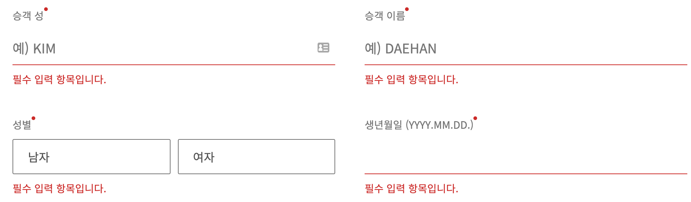
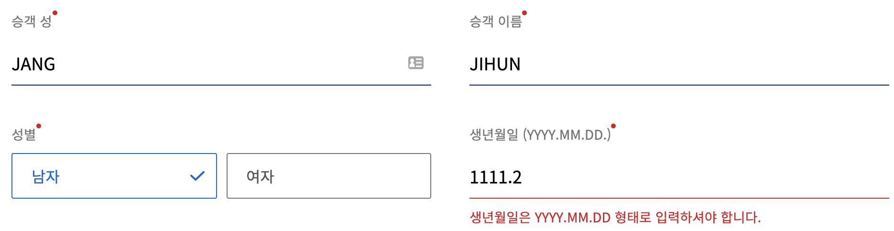
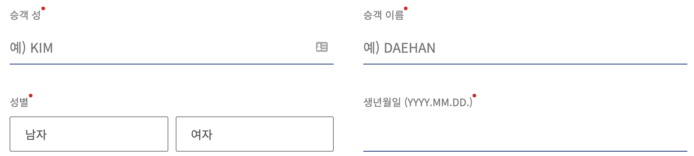
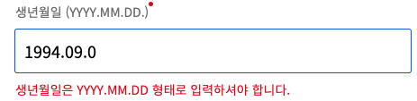
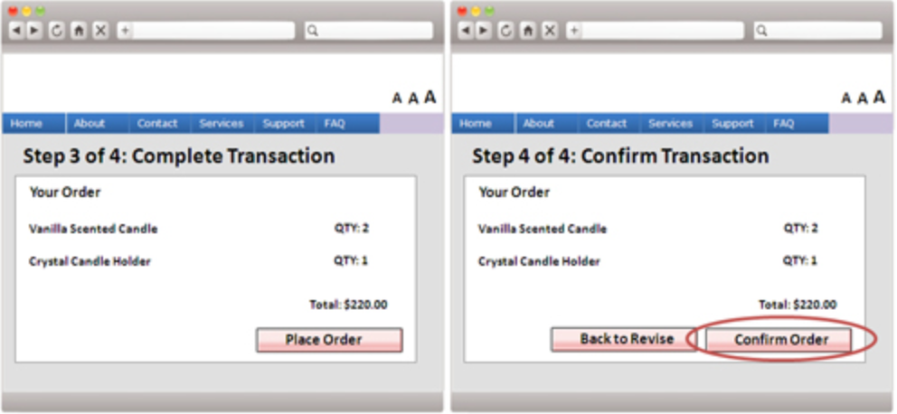
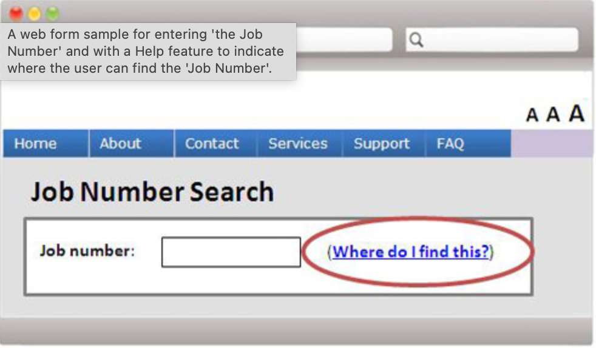
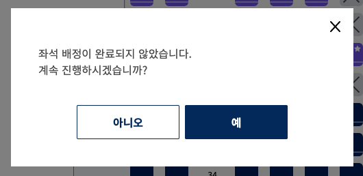

# 3.3 입력 지원 (Input Assistance)
사용자가 실수를 회피하고 해결할 수 있도록 지원해야 합니다.

## 3.3.1 오류 식별 [A]
입력 오류가 자동으로 감지되면 오류가 있는 항목을 식별하고 해당 오류를 사용자에게 설명합니다.
- 취지는 사용자가 오류가 발생했음을 인식하고 무엇이 잘못되었는지 확인할 수 있게 하는 것입니다.
  - 오류 메시지는 가능한 구체적이어야 합니다.
  - 텍스트 설명 외에도 이미지, 색상 등과 같은 다른 방법으로 오류를 표시하는 것도 허용합니다.

### 대상
- 텍스트로 정보 제공 시 시각 장애, 색맹인 사용자가 오류가 발생했다는 사실을 알 수 있습니다.
- 인지(시작적 단서), 언어 및 학습 장애가 있는 사람들에게 도움이 될 수 있습니다.

### 예시
- 대한항공 항공권 예매 페이지에서 양식의 필드를 하나라도 완료되지 않았거나 잘못 완성 된 경우 사용자에게 누락되거나 잘못된 필드를 알리는 경고가 표시됩니다. 
 
 

## 3.3.2 레이블 또는 지침 [A]
콘텐츠에 사용자 입력이 필요한 경우, 레이블 또는 지침이 제공되어야 합니다.
- 취지는 사용자가 어떤 입력 데이터가 예상되는지 알 수 있도록 콘텐츠 작성자가 컨트롤을 식별하는 지침 또는 레이블을 제공하도록 하는 것입니다.
  - 장애인에게 도움이 될 중요한 단서와 지침을 제공하는 것입니다.
  - 단, 너무 많은 정보나 지시는 너무 적은만큼 헤로울 수 있습니다.

### 대상
- 모든 사용자(특히 인지, 언어 및 학습 장애가 있는)가 정보를 올바르게 입력하는데 도움이 됩니다.
- 사용자가 불완전하거나 잘못된 양식을 제출하는 것을 방지할 수 있습니다.
  - 제출 오류를 수정하기 위해 페이지/양식을 한 번 더 탐색하지 않아도 됩니다.

### 예시
- 대한항공 항공권 예매 페이지에서 양식의 각 필드는 명확한 레이블이 명시되어 있고, 생년월일 입력 필드에는 올바른 형식을 나타내는 초기 텍스트가 포함되어 있습니다. 
 

## 3.3.3 오류 수정 제안 [AA]
입력 오류가 자동으로 감지되고 수정에 대한 제안이 알려진 경우, 콘텐츠의 보안이나 목적을 위태롭게 하지 않는 한 이를 사용자에게 제공해야 합니다.
- 취지는 사용자가 가능한 경우 입력 오류를 수정하기 위한 적절한 제안을 받도록하는 것입니다.
  -  오류에 대한 설명을 제공하거나 사용자 에이전트가 기술 별, 프로그래밍 방식으로 결정된 정보를 기반으로 오류에 대한 설명을 제공할 수 있습니다.

### 대상
- 학습 장애가 있는 사용자가 양식을 성공적으로 채울 수 있습니다.
- 시각 장애가 있는 사용자는 입력 오류의 특성과 수정 방법을 더 쉽게 이해할 수 있습니다.
- 동작 장애가 있는 사람은 입력 값을 변경하는 데 필요한 횟수를 줄일 수 있습니다.

### 예시
- 대한항공 항공권 예매 페이지에서 생년월일을 잘못 입력시 입력값에 대한 도움말이 제공됩니다. 
 

## 3.3.4 오류 예방: 법률,재무,자료 [AA]
사용자에 대한 법적 책임이나 금융 거래가 발생하거나, 데이터 스토리지 시스템에서 사용자가 제어 가능한 데이터를 수정 또는 삭제하거나, 사용자 테스트 
- 응답을 제출하는 웹 사이트의 경우, 다음 중 하나 이상을 지원해야 합니다.
  - 되돌림: 제출한 것을 되돌릴 수 있어야 합니다.
  - 점검: 사용자가 입력한 데이터는 입력 오류를 점검하고 수정할 수 있는  기회를 제공해야 합니다.
  - 확인: 제출을 완료하기 전에 정보를 검토, 확인, 수정할 수 있는 메커니즘을   제공하야 합니다.
- 취지는 장애가 있는 사용자가 되돌릴 수 없는 작업을 수행할 때 실수로 인한 심각한 결과를 피할 수 있도록 돕는 것입니다.
  - 정보를 검토하고 수정할 수 있는 기능을 제공하면 심각한 결과를 초래하는 조치를 취하기 전에 실수를 감지할 수 있습니다.

### 대상
- 실수 할 가능성이 더 큰 모든 장애가 있는 사용자에게 도움이 됩니다.

### 예시
- 사용자는 온라인 쇼핑에서 주문한 정보를 확인하거나 변경할 수있습니다.
- 해당 페이지는 최종 제출 전에 사용자가 세부 정보를 확인한 후 변경할 수 있는 옵션을 제공합니다. 
 

## 3.3.5 도움말 [AAA]
상황에 맞는 도움말을 제공합니다.
- 취지는 사용자가 실수를 하지 않도록 돕는 것입니다.
  - 일부 장애가 있는 사용자는 일반 사용자보다 실수를 할 가능성이 더 높습니다.
  - 레이블이 모든 기능을 설명하기에 충분하지 않은 경우에만 제공하면 됩니다.
  - 도움말의 존재는 사용자에게 분명해야하며 필요할 때마다 얻을 수 있어야 합니다.

### 대상
- 쓰기 장애가 있는 개인과 읽기 및 지적 장애가 있는 사람들을 돕습니다.
- 노화되고 입력 및 조작에 동일한 어려움이 있는 사람들을 돕습니다.

### 예시
- 온라인 입사 지원 시 일부 질문은 구직자가 이해하기 어려울 수 있습니다. 각 질문 옆에 있는 도움말 링크는 각 질문에 대한 지침과 설명을 제공합니다.
- 현재 페이지와 관련된 도움말 기능을 제공하고 있습니다. 

## 3.3.6 오류 예방: 공통 [AAA]
사용자가 정보를 제출해야 하는 웹 페이지의 경우, 다음 중 하나 이상을 지원해야 합니다.
- 지원해야 하는 기능
  - 되돌림: 제출된 것을 되돌릴 수 있어야 합니다.
  - 점검: 사용자가 입력한 데이터는 입력 오류를 점검하고 수정할 수 있는  기회를 제공해야 합니다.
  - 확인: 제출을 완료하기 전에 정보를 검토, 확인, 수정할 수 있는 메커니즘을   제공하야 합니다.
- 취지는 장애가 있는 사용자가 되돌릴 수 없는 작업을 수행할 때 실수로 인한 심각한 결과를 피할 수 있도록 돕는 것입니다.
  - 사용자가 정보를 제출해야하는 모든 양식에 적용된다는 점에서 성공 기준 3.3.4 를 기반으로 합니다.

### 대상
- 실수 할 가능성이 더 큰 모든 장애가 있는 사용자에게 도움이 됩니다.

### 예시
- 대한항공 항공권 예매 시 좌석 선택을 할 수 있는데 해당 좌석 선택창에서 좌석을 선택하지 않고 나갈시 확인 메시지가 나타납니다. '아니오' 클릭 시 좌석을 다시 선택할 수 있습니다. 
 

## 참고 자료
- [홍콩 사무국](https://www.ogcio.gov.hk/)
- [이듬 WCAG 2.1](https://a11y.gitbook.io/)
- [대한항공](https://www.koreanair.com/kr/ko)
- [W3C WCAG 2.1](https://www.w3.org/TR/WCAG21/#status-messages)
