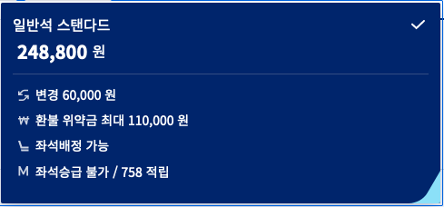
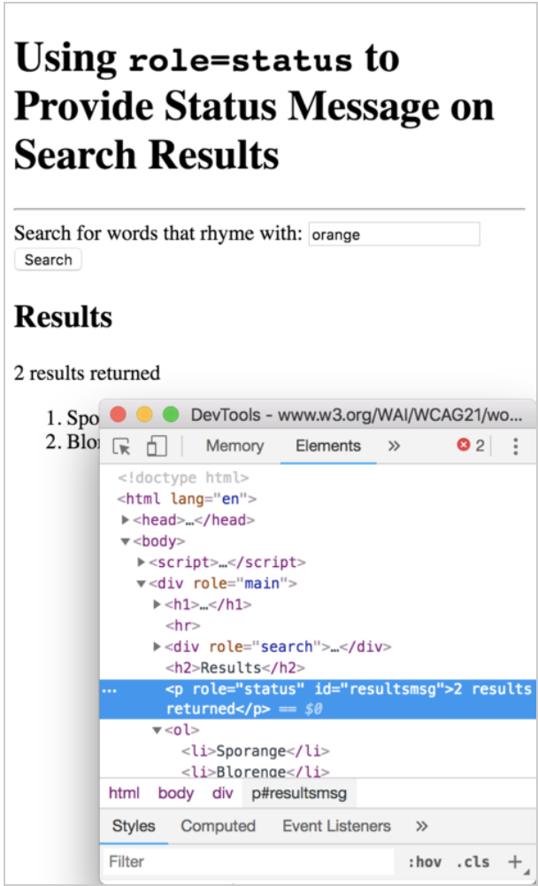

# 4.1 호환성 (Compatible)
보조 기술을 포함하여, 현재나 미래의 사용자 에이전트와의 호환성을 높여야 합니다.

> '사용자 에이전트'란 사용자를 위해 웹 콘텐츠를 불러오고 렌더링하며 인터렉션을 도와주는 웹 브라우저, 미디어 플레이어, 플러그인, 웹 콘텐츠 검색, 기타 프로그램(보조기술 포함)을 말합니다.

## 4.1.1 파싱 [A]
마크업 언어를 이용해 구현한 콘텐츠에서 각 요소는 시작과 종료 태그가 있고, 표준 기술 사양에 따라 중첩되며, 중복된 속성을 가져서는 안되고, 또한 모든 ID 속성 값은 유일해야 합니다.

> 닫는 꺽쇠 괄호 또는 일치하지 않는 속성값 따옴표와 같이, 서식에서 중요한 문자가 누락된 시작 및 종료 태그는 문법 오류입니다.

- 보조 기술을 포함한 사용자 에이전트가 내용을 정확하게 해석하고 구문 분석할 수 있게 됩니다.
  - 일부 에이전트는 구문 분석에 실패할 경우 '복구 기법'을 사용하여 내용을 렌더링합니다.
  - '복구 기법'은 사용자 에이전트마다 다르기 때문에 올바르게 해석될 것이라고 가정할 수 없습니다.

### 예시
- 다음과 같은 코드들은 파싱이 제대로 이루지지 않습니다.
  ```html
  <!-- 닫는 꺽쇠 누락 -->
  <p This is a paragraph</p>
  <!-- 닫는 태그의 슬래시 누락 -->
  <p>This is a paragraph<p>
  <!-- 불균형 속성 인용 -->
  <input title="name type="text">
  <!-- 속성 사이에 공백이 없음 -->
  <input title="name"type="text">
  ```

## 4.1.2 이름, 역할, 값 [A]
모든 UI 구성 요소(폼 요소, 링크 및 사용자 정의 구성 요소 등)는 이름(`name`)과 역할(`role`)은 프로그래밍 방식으로 설정할 수 있습니다. 또한 상태(`state`), 속성(`properties`) 및 값(`value`)도 프로그래밍 방식으로 설정할 수 있습니다. 이러한 설정 사항은 보조 기술을 포함한 사용자 에이전트에서 활용됩니다.

> 단, 이 가이드라인은 사용자 정의 UI 구성 요소를 개발하거나 스크립팅하는 웹 개발자를 위한 것입니다. HTML 표준 구성 요소를 사용하는 경우 이미 가이드라인이 충족합니다.

- 보조 기술이 컨텐츠의 UI 제어 상태에 대한 정보를 수집, 활성화(또는 설정)하고 최신 상태를 유지할 수 있도록 하는 것입니다.
  - 커스텀 컨트롤을 만들거나 구성 요소가 다른 역할 또는 기능을 갖도록 프로그래밍 된 경우, 해당 기능이 보조 기술에 정보를 제공하고 보조 기술에 의해 제어될 수 있도록 하기 위한 추가 조치가 필요합니다.

### 대상
- 보조 기술(스크린 리더, 화면 돋보기, 음성 인식 소프트웨어)과의 호환이 가능합니다.

### 예시
- 대한항공 사이트의 경우 div 태그의 역할을 main, radio 등으로 지정하고 있습니다.<br />
  <br />
  ``` html
  <!-- 컨네이너라는 별칭을 가진 div 코드-->
  <div _ngcontent-nld-c5="" class="container" role="main"></div>
  <!-- 대한항공 좌석 선택창의 코드-->
  <div role="radio" ...></div>
  ```
- 대한항공 사이트의 메인 네비게이션 확인 시 'aria-expanded' 속성을 사용하여 상태를 알려줍니다.<br />
  <br />
  ``` html
  <button type="button" aria-expanded="true" 
    aria-controls="gnb-KE161914981887836-1" ...>공항</button>
  ```

## 4.1.3 상태 메시지 [AA]
HTML 마크업 언어를 사용하여 구현된 상태 메시지의 경우, 프로그래밍 방식으로 역할 또는 속성을 설정 함으로서, 포커스 상태가 아니어도 보조 기술에 의해 사용자에게 표시되거나 읽힐 수 있습니다.
- 상태 메시지는 사용자에게 중요하지만 초점을 변경할 정도로 중요하지 않은 새 콘텐츠입니다.
- 사용자에게 초점이 부여되지 않은 콘텐츠의 중요한 변화를 알리고 작업을 불필요하게 중단하지 않는 방식으로 수행하는 것입니다.

### 대상
중요한 상태 메시지를 잘 전달하는 보조 기술의 능력으로 더 많은 사용자가 동등한 정보를 인식할 수 있습니다.
- 스크린 리더를 사용하는 시각 장애인 및 저시력 사용자
- 화면을 확대해서 보는 사용자
- 일부 인지 장애가 있는 사용자 

### 예시
- 검색 결과에 `role="status"` 속성을 가지고 있는 메시지를 포함하면 스크린 리더가 사용자에게 해당 메시지를 알려줍니다.<br />
<br />

- 개발자는 스크린리더 사용자에게 상태 메시지를 알리기 위한 ARIA Live를 사용해야 합니다.
  ```html
  <p role="status" aria-live="off">
    이 텍스트가 업데이트 되어도 스크린리더 사용자에게 아무런 안내를 하지 않습니다.
  </p>

  <p role="status" aria-live="polite">
    이 텍스트가 업데이트 되면, 사용자가 어떤 일을 수행하지 않을 때 상태 메시지를 알려줍니다.
  </p>

  <p role="status" aria-live="assertive">
    이 텍스트가 업데이트 되면, 사용자가 어떤 일을 수행하든 즉시 상태 메시지를 알려줍니다.
  </p>
  ```

## 참조 자료
- [널리 WCAG 문서](https://nuli.navercorp.com/data/blog/Understanding_WCAG_2_ko_by_NULI.pdf)
- [이듬 WCAG 2.1](https://a11y.gitbook.io/)
- [대한항공](https://www.koreanair.com/kr/ko)
- [W3C WCAG 2.1](https://www.w3.org/TR/WCAG21/#status-messages)
- [HARVARD](https://accessibility.huit.harvard.edu/)